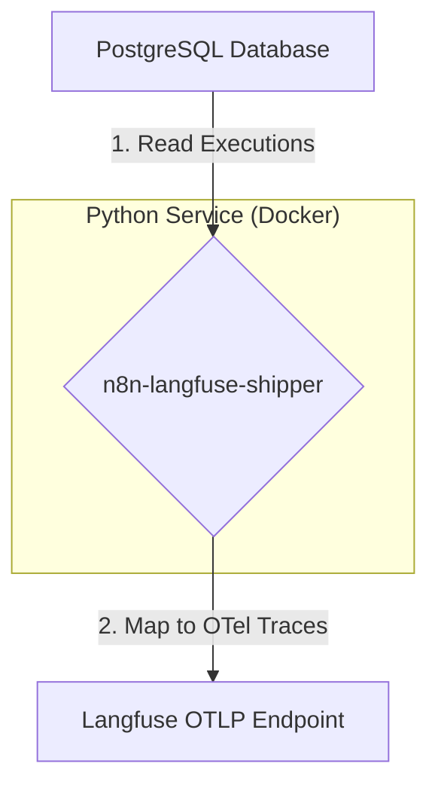

# AI Coding Agent Instructions for n8n-langfuse-shipper

## Purpose
This project is a Python-based microservice to perform a high-throughput backfill of historical n8n execution data from a PostgreSQL database to Langfuse. The service will map n8n's execution model to the Langfuse data model and transmit the data via the OpenTelemetry (OTLP) endpoint. The focus is on correctness, performance, and robustness for large-scale data migration.

## Big Picture Architecture
The service operates as a standalone ETL (Extract, Transform, Load) process, designed for containerized, cron-based execution.



1.  **Extract:** The service connects to the n8n PostgreSQL database and streams execution records (`n8n_execution_entity` joined with `n8n_execution_data`).
2.  **Transform:** Each execution record is transformed into a single Langfuse trace. The nodes within the execution are mapped to nested OpenTelemetry spans. This includes mapping specific AI node runs to Langfuse `Generation` objects via semantic attributes and handling multimodal (binary) data.
3.  **Load:** The transformed trace and its spans are exported to the Langfuse OTLP endpoint using the OpenTelemetry SDK.

## Core Data Models (Pydantic)
All internal data structures must be defined using Pydantic models for type safety and validation.

### 1. Raw N8N Data Models
Create Pydantic models to represent the JSON data retrieved from the `n8n_execution_data` table. Focus on the nested structure under `data.executionData.resultData.runData`.

```python
# src/n8n_data/models.py
from pydantic import BaseModel, Field
from typing import Any, Dict, List, Optional, Union

class NodeRunSource(BaseModel):
    previousNode: Optional[str] = None
    previousNodeRun: Optional[int] = None

class NodeRun(BaseModel):
    startTime: int
    executionTime: int
    executionStatus: str
    data: Dict[str, Any]
    source: Optional[List[NodeRunSource]] = None
    inputOverride: Optional[Dict[str, Any]] = None
    error: Optional[Dict[str, Any]] = None

class ResultData(BaseModel):
    runData: Dict[str, List[NodeRun]]

class ExecutionDataDetails(BaseModel):
    resultData: ResultData

class ExecutionData(BaseModel):
    executionData: ExecutionDataDetails

class WorkflowNode(BaseModel):
    name: str
    type: str
    category: Optional[str] = None

class WorkflowData(BaseModel):
    id: str
    name: str
    nodes: List[WorkflowNode]

class N8nExecutionRecord(BaseModel):
    id: int
    workflowId: str
    status: str
    startedAt: datetime
    stoppedAt: datetime
    workflowData: WorkflowData
    data: ExecutionData
```

### 2. Langfuse Target Models
These models represent the logical structure before creating OTel objects.

```python
# src/langfuse_models/models.py
from pydantic import BaseModel, Field
from typing import Any, Dict, List, Optional

class LangfuseUsage(BaseModel):
    promptTokens: Optional[int] = None
    completionTokens: Optional[int] = None
    totalTokens: Optional[int] = None

class LangfuseGeneration(BaseModel):
    span_id: str
    model: Optional[str] = None
    usage: Optional[LangfuseUsage] = None
    input: Optional[Any] = None
    output: Optional[Any] = None

class LangfuseSpan(BaseModel):
    id: str
    trace_id: str
    parent_id: Optional[str] = None
    name: str
    start_time: datetime
    end_time: datetime
    observation_type: str = "span"
    input: Optional[Any] = None
    output: Optional[Any] = None
    metadata: Dict[str, Any] = Field(default_factory=dict)
    error: Optional[Dict[str, Any]] = None

class LangfuseTrace(BaseModel):
    id: str
    name: str
    timestamp: datetime
    metadata: Dict[str, Any] = Field(default_factory=dict)
    spans: List[LangfuseSpan] = Field(default_factory=list)
    generations: List[LangfuseGeneration] = Field(default_factory=list)
```

## Mapping Logic
The core transformation logic resides in a dedicated `mapper` module.

### Trace Mapping
- An `N8nExecutionRecord` maps to a single `LangfuseTrace`.
- `LangfuseTrace.id` must be deterministic, e.g., `f"n8n-exec-{record.id}"`.
- `LangfuseTrace.name` is `record.workflowData.name`.
- `LangfuseTrace.timestamp` is `record.startedAt`.
- `LangfuseTrace.metadata` must include `workflowId` and `status`.

### Span Mapping
- Each `NodeRun` within `runData` maps to a `LangfuseSpan`.
- `LangfuseSpan.id` must be deterministic, e.g., a UUIDv5 hash of `f"{trace_id}:{node_name}:{run_index}"`.
- `LangfuseSpan.start_time` is derived from `NodeRun.startTime`.
- `LangfuseSpan.end_time` is `startTime + executionTime` (in milliseconds).
- **Parent-Child Linking:** The parent span ID should be derived by looking up the ID of the node specified in `NodeRun.source[0].previousNode`.

### Observation Type Mapping
- Port the Python `observation_type_mapper.py` logic from the conversation context.
- Create a lookup map of `node_name -> (normalized_type, category)` from `workflowData.nodes`.
- Use this map to determine the `LangfuseSpan.observation_type` for each node run.
- This value will be set as the `langfuse.observation.type` attribute on the OTel span.

### Generation Mapping
- Identify LLM node runs by checking for specific node types (e.g., `AzureOpenAi`, `GoogleVertexChatModel`) or the presence of `tokenUsage` in the `NodeRun.data`.
- For each LLM run, create a `LangfuseGeneration` object.
- Map `tokenUsage` to `LangfuseGeneration.usage`.
- Map model parameters from `inputOverride` to `gen_ai.request.*` attributes on the corresponding OTel span.
- Map token usage to `gen_ai.usage.*` attributes.
- Langfuse will automatically create a `generation` observation from a span containing these attributes.

### Multimodality Mapping
n8n stores binary data within the execution JSON. Langfuse requires a hybrid approach for ingestion.
1.  **Detect:** During mapping, identify binary data fields (e.g., a `binary` key with base64 data).
2.  **Upload:** Use the Langfuse REST API (`POST /api/public/media`) to upload the binary content. This requires a separate, authenticated `httpx` client.
3.  **Replace:** In the `LangfuseSpan.input` or `output` field, replace the original binary data object with the Langfuse Media Token string returned by the API (`@@@langfuseMedia:type=...|id=...|source=...@@@`).
4.  **Transmit:** Send the OTel span with the reference string as an attribute. Langfuse UI will render the media inline.

## OpenTelemetry Configuration
- Use the `opentelemetry-sdk` and `opentelemetry-exporter-otlp-proto-http` packages.
- Configure an `OTLPSpanExporter` to point to the Langfuse OTLP endpoint: `https://<region>.cloud.langfuse.com/api/public/otel/v1/traces`.
- Authentication must be provided via an `Authorization: Basic <base64(pk:sk)>` header. Configure this using the `OTEL_EXPORTER_OTLP_HEADERS` environment variable or directly in the exporter setup.
- Use a `BatchSpanProcessor` for efficient network usage.

## Application Flow & Control
- **Main Loop:** The application should be a runnable script that:
    1.  Loads a checkpoint (last processed `executionId`).
    2.  Enters a loop to fetch batches of executions from PostgreSQL starting after the checkpoint ID.
    3.  For each execution, performs the full mapping to a `LangfuseTrace` object.
    4.  Passes the `LangfuseTrace` object to a shipper/exporter class.
    5.  The shipper creates the OTel root and child spans with correct timings and attributes.
    6.  Updates the checkpoint after each successful batch.
- **Checkpointing:** Store the last successfully processed `executionId` in a local file (`.backfill_checkpoint`) or a dedicated database table to ensure resumability.
- **CLI Interface:** Use `Typer` or `argparse` to create a command-line interface for the script. It should support arguments like `--limit`, `--start-after-id`, and `--run-once`.

## Key Environment Variables
The application must be configurable via environment variables, managed by `pydantic-settings`.

- `PG_DSN`: PostgreSQL connection string.
- `LANGFUSE_HOST`: The base URL for Langfuse (e.g., `https://cloud.langfuse.com`).
- `LANGFUSE_PUBLIC_KEY`: Langfuse public key.
- `LANGFUSE_SECRET_KEY`: Langfuse secret key.
- `LOG_LEVEL`: Logging level (e.g., `INFO`, `DEBUG`).
- `FETCH_BATCH_SIZE`: Number of executions to fetch from Postgres per query.
- `TRUNCATE_FIELD_LEN`: Maximum character length for large I/O fields to prevent oversized spans.

## Development Plan (Iterations)

1.  **Core Setup:** Initialize the Python project, define Pydantic models for raw n8n data, and implement the PostgreSQL data source class.
2.  **Basic Mapping & OTel:** Implement the basic trace/span mapping logic. Set up the OTel SDK and exporter to successfully send a single, simple trace to Langfuse.
3.  **Advanced Mapping:** Integrate the observation type and generation mapping logic. Verify that spans are correctly typed and generations appear in the Langfuse UI.
4.  **Multimodality:** Implement the hybrid media upload and reference replacement logic. Test with an execution containing an image or PDF.
5.  **Productionization:** Implement robust checkpointing, a CLI, error handling with retries, and create a `Dockerfile`.

## Key Files & Project Structure

```
n8n-langfuse-shipper/
├── src/
│   ├── __main__.py         # CLI entry point
│   ├── config.py           # Pydantic settings
│   ├── db.py               # PostgreSQL data source
│   ├── mapper.py           # Core mapping logic
│   ├── observation_mapper.py # Observation type mapping logic
│   ├── shipper.py          # OTel and Langfuse Media API clients
│   └── models/
│       ├── __init__.py
│       ├── n8n.py          # Pydantic models for n8n data
│       └── langfuse.py     # Pydantic models for Langfuse objects
├── Dockerfile
├── pyproject.toml
└── README.md
```

## Conventions & Best Practices
- **Idempotency:** Use deterministic UUIDs for spans and traces to prevent duplicates on re-runs.
- **Error Handling:** Wrap all network and database operations in try/except blocks with logging and a retry mechanism (e.g., using the `tenacity` library).
- **Logging:** Use structured logging to provide clear, queryable logs about progress, errors, and performance.
- **Data Truncation:** Be aggressive in truncating large input/output fields (`TRUNCATE_FIELD_LEN`) to avoid hitting OTel payload size limits and to manage costs. Indicate truncation in the metadata.