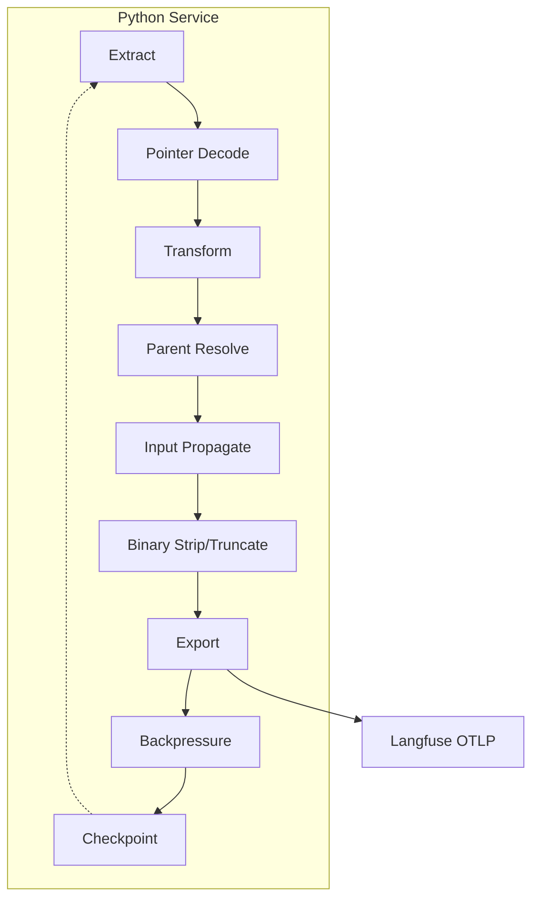

# AI Coding Agent Instructions for n8n-langfuse-shipper

## Purpose
This project is a Python-based microservice to perform a high-throughput backfill of historical n8n execution data from a PostgreSQL database to Langfuse. The service will map n8n's execution model to the Langfuse data model and transmit the data via the OpenTelemetry (OTLP) endpoint. The focus is on correctness, performance, and robustness for large-scale data migration.

## Document Sync & Version Policy
This file is a normative contract. Any behavioral change to mapping, identifiers, timestamps, parent resolution, truncation, binary stripping, generation detection, or environment semantics MUST be reflected here and in matching tests plus the README in the same pull request. Tests are the authority when ambiguity arises; if tests and this document diverge, update this document. Do not introduce silent behavior drift. Last major sync: 2025-09-23.

### Mermaid Diagram Authoring Guidelines (Strict)
To avoid recurrent rendering / parse issues, ALL Mermaid diagrams in this repository MUST follow the simplified style below. Treat this as a hard rule (update tests/docs if you intentionally need richer syntax later):

1. Use only `graph TD` (top‑down) unless a compelling reason exists; then document the rationale inline.
2. Node labels: ASCII only, short (1–3 words). No HTML tags (`<br/>`), no Unicode arrows (e.g. `→`), no emojis, no parentheses inside labels; prefer `Parent Resolve` instead of `Parent Resolver (Agent)`.
3. Multi-line labels are forbidden (no `\n`, no `<br/>`). If extra context needed, put a `%%` comment beneath the node.
4. Subgraph syntax: `subgraph IDENTIFIER [Readable Title]` — identifier must be alphanumeric/underscore; do not rely on spaces or punctuation in the identifier.
5. Edges: plain `-->` or dotted `-.->` only. No link text or styles unless absolutely required; if used, add a justification comment.
6. Comments: only `%%` full-line comments. Remove HTML comment forms (`<!-- ... -->`).
7. No class/style/link directives (`classDef`, `style`, `linkStyle`, `click`) in baseline diagrams. Introduce them only with prior review and add a note explaining necessity.
8. Keep diagrams minimal: prefer one high-level pipeline diagram. Additional diagrams (e.g., parent precedence) should also follow the same simplified constraints.
9. Validate each diagram in the Mermaid Live Editor (default settings) before committing.
10. If a richer diagram is needed (colors, multiline), add a second simplified fallback version immediately below and mark the richer one as optional.

Violation of these guidelines should be treated like breaking an invariant—submit a corrective patch alongside any diagram change reverting to the simplified form.

## Glossary (Authoritative Short Definitions)
Concise definitions of recurring terms (use these exact meanings in code comments, docs, and tests). Adding a new conceptual term? – update here in same PR.

* Agent Hierarchy: Parent-child relationship inferred from any non-`main` workflow connection whose type starts with `ai_` (e.g. `ai_tool`, `ai_languageModel`, `ai_memory`, `ai_outputParser`, `ai_retriever`, etc.) making the agent span the parent.
* Backpressure: Soft limiting mechanism (queue size vs `EXPORT_QUEUE_SOFT_LIMIT`) that triggers exporter flush + sleep (`EXPORT_SLEEP_MS`).
* Binary Stripping: Unconditional replacement of binary/base64-like payloads with stable placeholders prior to (optional) truncation.
* Checkpoint: Persistent last processed execution id stored on successful export; guarantees idempotent resume.
* Deterministic IDs: Stable UUIDv5 span ids and raw execution id as logical trace id; re-processing identical input yields identical structure and ids.
* Execution (n8n execution row): Single joined `execution_entity` + `execution_data` record; maps to exactly one Langfuse trace.
* Execution id: Raw integer primary key of the n8n execution row; appears only once as root span metadata `n8n.execution.id`.
* Generation: Span classified as an LLM call via heuristics (`tokenUsage` presence OR provider substring) optionally with token usage and model metadata.
* Human-readable Trace ID (OTLP): 32-hex trace id produced by `_build_human_trace_id` embedding zero‑padded execution id digits as suffix; distinct from logical trace id string.
* Input Propagation: Injecting parent span raw output as child logical input when `inputOverride` absent.
* Multimodality (Future): Planned binary/media upload phase replacing placeholders with Langfuse media tokens (feature-flag gated, not implemented).
* NodeRun: Runtime execution instance of a workflow node (with timing, status, source chain info, outputs, error).
* Observation Type: Semantic classification (agent/tool/chain/etc.) derived by `observation_mapper.py` fallback chain (exact → regex → category → default span).
* Parent Resolution Precedence: Ordered strategy: Agent Hierarchy → Runtime exact run → Runtime last span → Static reverse graph → Root.
* Pointer-Compressed Execution: Alternative list-based JSON encoding using index string references; reconstructed into canonical `runData` by `_decode_compact_pointer_execution`.
* Root Span: Span representing entire execution; holds execution id metadata; parent of all top-level node spans.
* runData: Canonical dict mapping node name → list[NodeRun] reconstructed or parsed from execution data JSON.
* Truncation: Optional length limiting of stringified input/output fields when `TRUNCATE_FIELD_LEN > 0`; does not disable binary stripping.
* Usage Extraction: Normalize `tokenUsage` variants (promptTokens/completionTokens/totalTokens, prompt/completion/total, input/output/total) into canonical `input`, `output`, `total` counts (synthesizing `total` as input+output when absent).


## Big Picture Architecture
The service operates as a standalone ETL (Extract, Transform, Load) process, designed for containerized, cron-based execution.


Canonical definitions live in `src/models/n8n.py`. Do NOT inline-edit model shapes here—change the code + tests + then update this narrative only if semantics (fields / meaning) shift. The models cover execution entity metadata, workflow graph (`WorkflowData`), and runtime node runs (`NodeRun`).
1.  **Extract:** The service connects to the n8n PostgreSQL database and streams execution records (`n8n_execution_entity` joined with `n8n_execution_data`).
2.  **Transform:** Each execution record is transformed into a single Langfuse trace. The nodes within the execution are mapped to nested OpenTelemetry spans. This includes mapping specific AI node runs to Langfuse `Generation` objects via semantic attributes and handling multimodal (binary) data.
3.  **Load:** The transformed trace and its spans are exported to the Langfuse OTLP endpoint using the OpenTelemetry SDK.
Canonical definitions live in `src/models/langfuse.py`. These are the internal logical structures prior to OTLP span creation (trace, span, generation, usage). Extend with extreme caution: new fields demand tests & README alignment.
<!-- MEDIA ROADMAP START -->
## Media & Multimodality Roadmap
Current (implemented): detection + placeholder redaction of large/binary payloads (see Binary Handling). Mapping layer remains PURE—no network calls for media.

Planned (not yet implemented; MUST undergo human review before coding):
1. Collect original binary prior to stripping (buffer or streaming source handle) in a staging structure outside the mapper.
2. Post-mapping media upload phase (separate module) calls Langfuse REST `POST /api/public/media`.
3. Replace placeholder objects with media tokens of form `@@@langfuseMedia:<token>`.
4. On upload failure: retain original placeholder; never fail entire trace.
5. Circuit breaker: consecutive failures short-circuit uploads temporarily.

Guardrails:
* DO NOT add upload logic to `mapper.py` (purity invariant).
* Any new env vars enabling upload require README + tests + here update in same PR.
* A feature flag (future: `ENABLE_MEDIA_UPLOAD`) must default to disabled.
<!-- MEDIA ROADMAP END -->
1. One n8n execution row (entity+data) maps to exactly one Langfuse trace.
2. Node span id format: `UUIDv5(namespace=SPAN_NAMESPACE, name=f"{trace_id}:{node_name}:{run_index}")` (deterministic per node run index).
3. execution id appears only once: root span metadata key `n8n.execution.id` (never duplicated elsewhere).
4. All timestamps are timezone-aware UTC. Any naive datetime encountered is normalized to UTC (tests enforce no naive patterns). Never use `datetime.utcnow()`.
5. Spans are emitted strictly in chronological order (NodeRun `startTime`) so parents precede children; export order mirrors creation order.
6. Binary/base64 stripping ALWAYS applies. Truncation is opt-in (`TRUNCATE_FIELD_LEN=0` disables truncation but not binary stripping).
7. Parsing failures still yield a root span; never drop an execution silently.
8. All internal data structures defined with Pydantic models (validation + type safety mandatory).
9. Database access is read-only (SELECTs only) and respects dynamic table prefix logic.
10. Determinism: identical input rows yield identical span/trace ids & structures (aside from inherently varying runtime like sequence ordering which is stable by design).

## Core Data Models (Pydantic)
All internal data structures must be defined using Pydantic models for type safety and validation.

### 1. Raw N8N Data Models
These models represent the JSON data retrieved from the `n8n_execution_data` and `n8n_execution_entity` tables.

```python
# src/models/n8n.py
from __future__ import annotations

from datetime import datetime
from typing import Any, Dict, List, Optional
from pydantic import BaseModel, Field


- No new dependencies without `pyproject.toml` update + rationale.
- Preserve deterministic UUIDv5 namespace + seed formats (ID immutability). Changing trace id embedding format requires test + doc updates.
- Mapper stays pure (no network / DB writes). Media upload must reside in a separate phase/module.
- Do NOT move execution id outside root span or duplicate it (breaks single-source invariant).
- Never introduce `datetime.utcnow()` (timezone invariant). All timestamps must be UTC-aware.
- Backwards compatibility: never rename/remove public model fields without migration notes.
- Update README + this file for new env vars / CLI flags / behavior changes in the same PR.
- NOTICE & LICENSE untouched aside from annual year updates.
- New metadata keys: add tests asserting presence & absence where appropriate.
    startTime: int
    executionTime: int
    executionStatus: str
    data: Dict[str, Any] = Field(default_factory=dict)
    source: Optional[List[NodeRunSource]] = None
    inputOverride: Optional[Dict[str, Any]] = None
    error: Optional[Dict[str, Any]] = None


class ResultData(BaseModel):
    runData: Dict[str, List[NodeRun]] = Field(default_factory=dict)


class ExecutionDataDetails(BaseModel):
<!-- PIPELINE SUMMARY START -->
## Quick Pipeline Summary


class ExecutionData(BaseModel):
    executionData: ExecutionDataDetails


class WorkflowNode(BaseModel):
    name: str
    type: str
    category: Optional[str] = None
<!-- PIPELINE SUMMARY END -->


class WorkflowData(BaseModel):
## Failure & Resilience Philosophy
* Parsing issues (`_build_execution_data` / pointer decoding) result in a root-only trace (never dropped execution). Error context captured in root span metadata or error field if available.
* Database transient errors retried (exponential backoff) without duplicating already-exported spans (checkpoint only advances after successful export).
* Exporter backpressure uses soft-limit sleep to avoid memory growth.
* Mapping phase must not raise uncaught exceptions that terminate the stream except for irrecoverable configuration errors (e.g., missing credentials).
* Future: dead-letter queue for repeated mapping failures; until then, log with clear structured fields.


class N8nExecutionRecord(BaseModel):
    id: int
    workflowId: str
    status: str
    startedAt: datetime
    stoppedAt: datetime
    workflowData: WorkflowData
    data: ExecutionData
```

### 2. Langfuse Target Models
These models represent the logical structure before creating OTel objects.

```python
# src/models/langfuse.py
from __future__ import annotations

from datetime import datetime
from typing import Any, Dict, List, Optional
from pydantic import BaseModel, Field


class LangfuseUsage(BaseModel):
    input: Optional[int] = None
    output: Optional[int] = None
    total: Optional[int] = None


class LangfuseSpan(BaseModel):
    id: str
    trace_id: str
    parent_id: Optional[str] = None
    name: str
    start_time: datetime
    end_time: datetime
    observation_type: str = "span"
    input: Optional[Any] = None
    output: Optional[Any] = None
    metadata: Dict[str, Any] = Field(default_factory=dict)
    error: Optional[Dict[str, Any]] = None
    model: Optional[str] = None
    token_usage: Optional[LangfuseUsage] = None
    status: Optional[str] = None


class LangfuseTrace(BaseModel):
    id: str
    name: str
    timestamp: datetime
    metadata: Dict[str, Any] = Field(default_factory=dict)
    spans: List[LangfuseSpan] = Field(default_factory=list)
```

## Data Parsing & Resilience
The `data` column in `n8n_execution_data` can have multiple formats. The application must robustly parse them.
- **Standard Format:** A JSON object containing an `executionData` key.
- **Pointer-Compressed Format:** A top-level JSON array where objects reference other array elements by their index. Implement a resolver (`_decode_compact_pointer_execution`) to reconstruct the `runData` from this format.
- **Alternative Paths:** The `runData` object might be located at different nested paths. The parser (`_build_execution_data`) must probe multiple candidate paths to find it.
- **Empty/Invalid Data:** If `runData` cannot be found, the execution should still be processed, resulting in a trace with only a root span.

### Pointer-Compressed Decoding
`_decode_compact_pointer_execution` reconstructs executions stored as a top-level list of heterogenous objects referencing each other via string indices. Cycle protection and memoization are used. On failure it returns `None` so the caller can fall back to path probing.

## Mapping Logic
The core transformation logic resides in the `mapper` module. It must use a hybrid approach, combining runtime data with the static workflow graph.

### The Agent/Tool Hierarchy
A key pattern in n8n, especially with LangChain nodes, is an "Agent" node that uses other nodes as "Tools", "LLMs", or "Memory". The `workflowData.connections` object reveals this.
- A connection with `type: "main"` represents a sequential step.
- A connection with any `type` beginning with `ai_` (e.g. `ai_tool`, `ai_languageModel`, `ai_memory`, `ai_outputParser`, `ai_retriever`) from a component node (e.g., `Calculator`) *to* an agent node (e.g., `HAL9000`) signifies a **hierarchical relationship**.
- In this case, the agent's span is the **parent** of the component's span.

### Trace Mapping
- An `N8nExecutionRecord` maps to a single `LangfuseTrace`.
- `LangfuseTrace.id` must be deterministic: `str(record.id)` (raw execution id as string). One n8n instance per Langfuse project is REQUIRED; do not mix multiple databases into one project or execution id collisions may occur.
- A root `LangfuseSpan` is created to represent the entire execution. All top-level node spans are children of this root span.

### Span Mapping
- Each `NodeRun` maps to a `LangfuseSpan`.
- `LangfuseSpan.id` must be deterministic: a UUIDv5 hash of `f"{trace_id}:{node_name}:{run_index}"`.
- **Parent-Child Linking:** Implement a multi-tier logic for parent resolution:
    1.  **Hierarchical (Agent/Tool):** First, check `workflowData.connections`. If a node run corresponds to a node that is connected to an Agent via a non-`main` connection type, its parent is the most recent span of that Agent.
    2.  **Sequential (Runtime):** If not part of a hierarchy, use `run.source[0].previousNode` to find the immediate predecessor. Link to the exact run index (`previousNodeRun`) if available, otherwise link to the last seen span for that predecessor node.
    3.  **Sequential (Static Fallback):** If runtime `source` is missing, use a reverse-edge map built from `workflowData.connections` to infer the most likely parent from the static graph.
    4.  **Root Fallback:** If no parent can be determined, link to the root execution span.
- **I/O Propagation:** If a `NodeRun` lacks `inputOverride`, its logical input is inferred from the cached raw output of the resolved parent node: `{ "inferredFrom": <parent>, "data": <parent_raw_output> }`. Propagation always occurs; size guard limiting cached output applies only when truncation is enabled (`TRUNCATE_FIELD_LEN > 0`).

Additional implemented behavior:
* Reverse graph fallback marks metadata `n8n.graph.inferred_parent=true`.
* Agent hierarchy adds `n8n.agent.parent` and `n8n.agent.link_type` (value is the concrete `ai_*` connection type).
* Input propagation caching only size-guards when truncation active (`truncate_limit > 0`). When disabled, propagation always occurs.

### Observation Type Mapping
Use the `observation_mapper.py` module to classify each node based on its type and category. See the later "Observation Type Mapping" section (deduplicated) for the authoritative fallback chain.

### Generation Mapping
See the later "Generation Mapping" section for the current heuristics (deduplicated; outdated provider list removed here).

### Generation Mapping (Authoritative)
Heuristics (ordered, current implementation):
1. Presence of a `tokenUsage` object at any depth inside `run.data` (depth-limited recursive search; explicit signal).
2. Fallback: node type (case-insensitive) contains any provider marker in the current set:
    `openai`, `anthropic`, `gemini`, `mistral`, `groq`, `lmchat`, `lmopenai`, `cohere`, `deepseek`, `ollama`, `openrouter`, `bedrock`, `vertex`, `huggingface`, `xai`, `limescape`.
    Exclusions: if the type also contains `embedding`, `embeddings`, or `reranker`, it is NOT classified as a generation (to avoid misclassifying embedding/reranker tasks).

Notes:
* Provider marker expansions MUST update this section, the README, and `tests/test_generation_heuristic.py` in the same PR.
* Never infer a generation purely from output length or presence of text.
* Embedding / reranker nodes are intentionally excluded unless they provide explicit `tokenUsage`.

If matched:
* Populate `LangfuseSpan.model` best-effort from node type or name, or (if absent) by breadth-first nested search for variant keys (`model`, `model_name`, `modelId`, `model_id`) inside run.data output channel wrappers (provider substring preserved as-is; no normalization). When a generation span lacks any model value a debug metadata flag `n8n.model.missing=true` is attached.
* `_extract_usage` normalizes to `input`/`output`/`total`; if `total` absent but input & output present it is synthesized (input+output). Precedence: existing input/output/total > promptTokens/completionTokens/totalTokens > prompt/completion/total. Custom flattened Limescape Docs counters (`totalInputTokens`, `totalOutputTokens`, `totalTokens`) are also detected and mapped.
* OTLP exporter emits `gen_ai.usage.input_tokens`, `gen_ai.usage.output_tokens`, `gen_ai.usage.total_tokens` only for provided fields plus `model`, `langfuse.observation.model.name` when `model` populated.

### Multimodality Mapping (Future)
- Phase not yet implemented (see Media & Multimodality Roadmap). Planned flow once enabled:
    1. Detect binary fields.
    2. Upload via Langfuse media API (feature flag gated).
    3. Replace placeholders with `@@@langfuseMedia:<token>`; failures retain placeholders and do not abort trace export.

 **Attribute Mapping:** The shipper sets OTel attributes based on the `LangfuseSpan` model:
     - `langfuse.observation.type`
     - `model` & `langfuse.observation.model.name` (when `model` present)
    - `gen_ai.usage.input_tokens`, `gen_ai.usage.output_tokens`, `gen_ai.usage.total_tokens` (from normalized `input`/`output`/`total`; legacy prompt/completion names removed)
     - `langfuse.observation.usage_details` (JSON string containing only present keys among `input`/`output`/`total`)
     - `langfuse.observation.status` (normalized status) when available
     - `langfuse.observation.metadata.*` (flattened span metadata)
    - Root span only: `langfuse.internal.as_root=true`
    - Root span trace identity (when provided on `LangfuseTrace`): `user.id`, `session.id`, `langfuse.trace.tags` (JSON array), `langfuse.trace.input`, `langfuse.trace.output` (JSON serialized best-effort)
  (Removed: references to unused `langfuse.observation.level` / `status_message`).
* `binary` objects: replace `data` with `"binary omitted"` and attach `_omitted_len`; retain other metadata fields (filename, mimeType, etc.).
* Standalone base64 strings: replace with `{ "_binary": true, "note": "binary omitted", "_omitted_len": <length> }`.
 12. Human-readable OTLP trace id embedding: exporter derives a deterministic 32-hex trace id ending with zero-padded execution id digits (function `_build_human_trace_id`). The logical `LangfuseTrace.id` stays the raw execution id string. Changing this requires updating tests (`test_trace_id_embedding.py`), README, and this file simultaneously.

Binary stripping is unconditional (independent of truncation). Helpers: `_likely_binary_b64`, `_contains_binary_marker`, `_strip_binary_payload`. Future media upload will swap placeholders for `@@@langfuseMedia:<token>`.

### Custom Node Classification (Limescape Docs)
Custom node type `n8n-nodes-limescape-docs.limescapeDocs` is force-classified as a `generation` observation even when `tokenUsage` is absent. Provider marker `limescape` added to generation heuristic list. Flattened usage keys (`totalInputTokens`, `totalOutputTokens`, `totalTokens`) are recognized and mapped to `gen_ai.usage.*` attributes.

## OpenTelemetry Shipper
The `shipper.py` module converts the internal `LangfuseTrace` model into OTel spans and exports them.
- **Initialization:** The OTLP exporter is configured once with the Langfuse endpoint and Basic Auth credentials.
- **Span Creation:** For each `LangfuseSpan`, create an OTel span with the exact `start_time` and `end_time`.
- **Attribute Mapping:** The shipper sets OTel attributes based on the `LangfuseSpan` model:
    - `langfuse.observation.type` <- `observation_type`
    - `model` & `langfuse.observation.model.name` <- `model`
    - `gen_ai.usage.*` <- `token_usage` fields
    - `langfuse.observation.metadata.*` <- `metadata` dictionary
    - `langfuse.observation.level` and `status_message` for errors.
- **Trace Attributes:** Set trace-level attributes (`langfuse.trace.name`, `langfuse.trace.metadata.*`) on the root span.
Additional notes:
* Root span metadata holds `n8n.execution.id`; not duplicated on trace metadata.
* Export order mirrors creation order; parents precede children.
* Dry-run mode constructs spans but does not send them (useful for testing determinism).

## Application Flow & Control
- **Main Loop:** A CLI script (`__main__.py`) that loads a checkpoint, streams execution batches from PostgreSQL, maps each record to a `LangfuseTrace`, passes it to the shipper, and updates the checkpoint.
- **Checkpointing:** Use the `checkpoint.py` module to atomically store the last successfully processed `executionId` in a file.
- **CLI Interface:** Use `Typer`. The `backfill` command supports:
    - `--start-after-id`, `--limit`, `--dry-run`, `--debug`, `--debug-dump-dir`
    - `--truncate-len` (0 disables truncation)
    - `--require-execution-metadata` (only process if a row exists in `<prefix>execution_metadata` with matching executionId)

## Key Environment Variables
- `PG_DSN`: Full PostgreSQL connection string (takes precedence).
- `DB_POSTGRESDB_HOST`, `DB_POSTGRESDB_PORT`, `DB_POSTGRESDB_DATABASE`, `DB_POSTGRESDB_USER`, `DB_POSTGRESDB_PASSWORD`: Component-based DB connection variables.
- `DB_POSTGRESDB_SCHEMA`: Database schema (default: `public`).
- `DB_TABLE_PREFIX`: Optional table prefix (default if UNSET: `n8n_`; if set to empty string `""` no prefix is applied; any other explicit value is used verbatim). All table names are constructed dynamically at runtime—never hard-code `n8n_` in code paths.
- `LANGFUSE_HOST`, `LANGFUSE_PUBLIC_KEY`, `LANGFUSE_SECRET_KEY`.
- `LOG_LEVEL`, `FETCH_BATCH_SIZE`, `TRUNCATE_FIELD_LEN` (0 disables truncation; >0 enables).
- `REQUIRE_EXECUTION_METADATA` (bool): only include executions having at least one row in `<prefix>execution_metadata` with `executionId = e.id`.
 - Reliability / backpressure tuning (optional): `FLUSH_EVERY_N_TRACES`, `OTEL_MAX_QUEUE_SIZE`, `OTEL_MAX_EXPORT_BATCH_SIZE`, `OTEL_SCHEDULED_DELAY_MILLIS`, `EXPORT_QUEUE_SOFT_LIMIT`, `EXPORT_SLEEP_MS`.

### Environment Precedence Rules
1. `PG_DSN` (if non-empty) overrides component variables.
2. `DB_TABLE_PREFIX` unset → default `n8n_`; set to empty string → no prefix.
3. `TRUNCATE_FIELD_LEN=0` means disabled (still strip binary); positive value triggers truncation & size guard for propagation caching.
4. CLI flags override env values for that invocation.

## Development Plan (Next Iterations)
1. Media upload workflow (binary placeholder → upload → media token substitution).
2. Advanced filtering flags (status, workflow, time window, id bounds).
3. Parallel / async export pipeline (maintain deterministic ordering).
4. PII/sensitive field redaction (configurable; test enforced).
5. Dead-letter queue for persistent mapping failures.
6. Provider-specific model normalization improvements.
7. Metrics / Prometheus endpoint (optional instrumentation).
8. Adaptive backpressure metrics (dynamic sleep based on exporter latency).
9. Selective path-based truncation overrides.
10. Circuit breaker for media upload failures.

## Key Files & Project Structure
```
n8n-langfuse-shipper/
├── src/
│   ├── __main__.py
│   ├── config.py
│   ├── db.py
│   ├── mapper.py
│   ├── observation_mapper.py
│   ├── shipper.py
│   ├── checkpoint.py
│   └── models/
│       ├── __init__.py
│       ├── n8n.py
│       └── langfuse.py
├── Dockerfile
├── pyproject.toml
└── README.md
```

## Conventions & Best Practices
- **Idempotency:** Use deterministic UUIDs for spans and traces.
- **Error Handling:** Use `tenacity` for retrying database connections.
- **Logging:** Use structured logging for clear diagnostics.
- **Data Truncation:** Disabled by default; when enabled post-binary stripping, sets `n8n.truncated.input|output` metadata.
- **Binary Stripping:** Always on; do not remove without tests + docs.
- **Parent Resolution Order:** Agent hierarchy → runtime sequential exact run → runtime sequential last span → static graph reverse-edge → root.
- **Input Propagation:** Uses cached parent output unless explicit `inputOverride` present.
 - Parent resolution precedence is fixed (agent hierarchy → runtime exact run → runtime last span → static reverse edge → root). Do not reorder without updating tests.
- **Generation Detection:** Keep conservative; update tests when heuristics change.
- **Metadata Keys:** Additions require justification + test coverage.

## Reserved Metadata Keys
Root span:
- `n8n.execution.id`
All spans (optional context):
- `n8n.node.type`, `n8n.node.category`, `n8n.node.run_index`, `n8n.node.execution_time_ms`, `n8n.node.execution_status`
- `n8n.node.previous_node`, `n8n.node.previous_node_run`
- `n8n.graph.inferred_parent`
- `n8n.agent.parent`, `n8n.agent.link_type`
- `n8n.truncated.input`, `n8n.truncated.output`

Span status normalization: `LangfuseSpan.status` (if set) is derived from the logical success/error outcome and is distinct from the raw `n8n.node.execution_status` metadata value.

## Testing Guidance
Add / update tests when:
1. Changing parent resolution logic (each precedence path covered).
2. Adjusting binary stripping heuristics (base64, JPEG, nested arrays, `binary` object patterns).
3. Modifying generation detection or usage extraction.
4. Updating pointer-compressed decoding.
5. Changing truncation / propagation coupling.
Each new metadata key must appear in at least one assertion; forbidden duplications (e.g., execution id outside root span) should also be asserted negative.

### Pointer-Compressed Decoding (Detailed)
1. Detect top-level list form; if not list → return None.
2. Treat indices referenced as strings as pointers to other list entries.
3. Recursively expand with memoization; cycle detection aborts and returns None.
4. Search reconstructed structure for candidate `executionData.resultData.runData` paths.
5. Validate `runData` shape (dict[str, list[NodeRun-like]]). On success build model; else fallback to normal path probing.

### Timezone Policy
* All datetimes exported to OTLP are timezone-aware UTC.
* Naive datetimes from DB/JSON are localized to UTC (without offset shifting beyond assuming naive == UTC).
* `datetime.utcnow()` forbidden; enforcement test scans `src/` and `tests/`.

### Testing Contract Overview
| Area | Guarantee | Representative Tests (examples) |
|------|-----------|----------------------------------|
| Deterministic IDs | Same input → identical trace & span ids | `test_deterministic_ids.py` |
| Parent Resolution | Precedence order enforced (agent → runtime exact → runtime last → static reverse → root) | `test_parent_resolution_*` |
| Binary Stripping | All large/base64 & binary objects redacted, placeholders stable | `test_binary_stripping.py` |
| Truncation & Propagation | Truncation size guard only active when >0; propagation always otherwise | `test_truncation_propagation.py` |
| Generation Detection | Only spans meeting heuristics classified; token usage mapped | `test_generation_detection.py` |
| Pointer Decoding | Pointer-compressed arrays reconstructed or cleanly fallback | `test_pointer_decoding.py` |
| Timezone Enforcement | No naive datetimes; normalization to UTC | `test_timezone_awareness.py` |
| Trace ID Embedding | Embedded OTLP hex trace id matches expected format | `test_trace_id_embedding.py` |

If adding a new behavior category, extend this table and create/modify tests accordingly.

### Parent Resolution Precedence (Authoritative Table)
| Priority | Strategy | Description | Metadata Signals |
|----------|----------|-------------|------------------|
| 1 | Agent Hierarchy | Non-`main` connection whose type starts with `ai_` makes agent parent | `n8n.agent.parent`, `n8n.agent.link_type` |
| 2 | Runtime Sequential (Exact Run) | previousNode + previousNodeRun points to exact span | `n8n.node.previous_node_run` |
| 3 | Runtime Sequential (Last Seen) | previousNode without run index → last emitted span for node | `n8n.node.previous_node` |
| 4 | Static Reverse Graph Fallback | Reverse edge from workflow connections | `n8n.graph.inferred_parent=true` |
| 5 | Root Fallback | No parent resolved → root span | (none) |

Reordering requires updating tests and this table.

## Contribution Guardrails (AI & Humans)
- No new dependencies without `pyproject.toml` update + rationale.
* Preserve deterministic UUIDv5 namespace + seed formats (ID immutability).
* Mapper stays pure (no network / DB writes). Media upload logic must remain outside mapper.
* Backwards compatibility: never rename/remove public model fields without migration notes.
* Update README + this file for new env vars / CLI flags / behavior changes in same PR.
* NOTICE & LICENSE untouched aside from annual year updates.

<!-- PIPELINE SUMMARY START -->
## Quick Pipeline Summary
1. Fetch execution rows (optional metadata existence filter).
2. Parse (standard / alternative paths / pointer-compressed).
3. Flatten runs chronologically.
4. Resolve parents per precedence.
5. Infer inputs (unless overridden).
6. Strip binary → (optional) truncate.
7. Determine observation type & generation usage.
8. Build spans (generation classification lives on spans with `observation_type=="generation"`).
9. Export (or dry-run) via OTLP.
10. Update checkpoint (non dry-run). Root-only fallback still exported on parse failure.
<!-- PIPELINE SUMMARY END -->

## Performance Notes
- Streaming limits memory usage; only a batch of rows in memory.
- Caching only last outputs reduces accumulation risk.
- Potential optimization: batch OTLP export or async spans while preserving parent ordering.

## Media Upload (Future)
See consolidated Media & Multimodality Roadmap above. No upload logic implemented yet; placeholders remain.

## Failure & Resilience Philosophy
* Root-only fallback: malformed / missing runData still produces a trace with execution root span.
* DB transient errors: retried with exponential backoff; checkpoint only advances after successful export (prevents duplication).
* Backpressure: soft-limit queue metrics induce flush + sleep preventing memory growth while preserving ordering.
* Purity: mapper must not introduce network I/O or writes (idempotent replay guarantee).
* Fatal stop conditions limited to configuration errors (missing credentials, invalid DSN format).
* Planned: dead-letter queue for repeated mapping failures (retain error context without blocking pipeline).
* Logging: structured logging required for parse failures (`error`, `execution_id`, `phase`).

### Regression Checklist
1. Deterministic IDs unchanged.
2. execution id only on root span.
3. UTC timezone invariants respected (`test_timezone_awareness` green).
4. Parent precedence unchanged or tests updated.
5. Binary placeholders unchanged (size / marker keys stable) unless tests updated.
6. Generation heuristics stable (token usage mapping preserved).
7. Pointer decoding passes existing scenarios.
8. New env vars documented & tested.
9. No mapper network calls added.
10. Metadata key additions/removals reflected in tests + README.

---
This document is the authoritative contract. Any significant code change altering behavior here must include an update to this file in the same PR.