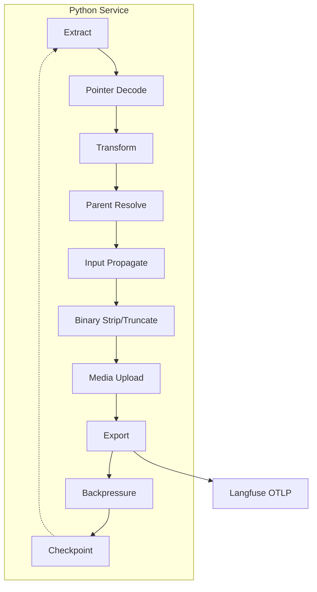

# AI Coding Agent Instructions for n8n-langfuse-shipper

## Quick Reference (AI Agent Onboarding)

**What**: Python ETL pipeline streaming n8n PostgreSQL execution history → Langfuse traces via OTLP
**Why**: shipper historical workflow executions for AI observability and debugging
**Stack**: Python 3.12+, Pydantic models, OpenTelemetry SDK, psycopg3, Fish shell

### 5-Minute Orientation
- **Entry point**: `src/n8n_langfuse_shipper/__main__.py` - Typer CLI orchestrating Extract→Transform→Load pipeline
- **Core transform**: `src/n8n_langfuse_shipper/mapping/orchestrator.py` - maps n8n NodeRuns to Langfuse spans with deterministic IDs
- **Models**: `src/n8n_langfuse_shipper/models/n8n.py` + `src/n8n_langfuse_shipper/models/langfuse.py` - Pydantic validation throughout
- **Config**: `src/n8n_langfuse_shipper/config.py` - Pydantic Settings from env vars (see "Environment Variables" section)
- **Tests**: Run `pytest` or `pytest -q` in Fish shell - 45+ test files assert invariants
- **Dev workflow**: `ruff check . && mypy src && pytest` before commits (line-length cap: 100 chars)

### Critical Invariants (NEVER VIOLATE)
1. **Deterministic IDs**: UUIDv5 with `SPAN_NAMESPACE` in `mapping/id_utils.py` - changing breaks idempotency
2. **Execution ID appears once**: Root span metadata `n8n.execution.id` only (never duplicated)
3. **Parent resolution**: 5-tier precedence (Agent Hierarchy → Runtime Exact → Runtime Last → Static Graph → Root) - see "Parent Resolution" section
4. **Binary stripping**: ALWAYS unconditional (even when truncation disabled) - see "Binary & Multimodality" section
5. **Timezone aware**: All datetimes UTC-aware, NEVER use `datetime.utcnow()` (test enforces this)
6. **Fish shell**: NO Bash heredocs/arrays; use `set -x VAR value` for exports; Python one-liners: `python -c "import sys; print('ok')"` pattern

### Where to Look
- **Mapping modules**: `src/n8n_langfuse_shipper/mapping/` - 13 pure submodules (orchestrator, binary_sanitizer, generation, parent_resolution, prompt_detection, prompt_resolution, prompt_version_resolver, etc.)
- **Parent resolution rules**: "Parent Resolution" section (Precedence table) + "Agent/Tool Hierarchy" section
- **Generation detection heuristics**: "Generation Detection" section (tokenUsage presence OR provider markers)
- **Binary & Media handling**: "Binary & Multimodality" section (stripping + media token flow when `ENABLE_MEDIA_UPLOAD=true`)
- **Reserved metadata keys**: "Reserved Metadata Keys" section (root span, spans, Gemini anomaly, media flags)
- **Testing contract**: "Testing Contract" section (deterministic IDs, parent precedence, binary stripping, timezone tests)
- **Environment variables**: "Environment Variables" section (complete table with defaults)

### Common Tasks

**For development (Fish shell):**
```fish
# Run specific test file
pytest tests/test_mapper.py -v

# Type check only mapping module
mypy src/n8n_langfuse_shipper/mapping/

# Dry-run first 25 executions
n8n-shipper shipper --limit 25 --dry-run

# Check for line length violations
ruff check . --select E501
```

**For users (Bash/Zsh):**
```bash
# Run specific test file
pytest tests/test_mapper.py -v

# Type check only mapping module
mypy src/n8n_langfuse_shipper/mapping/

# Dry-run first 25 executions
n8n-shipper shipper --limit 25 --dry-run

# Check for line length violations
ruff check . --select E501
```
### Module Refactor Status
Mapper logic extracted into `src/n8n_langfuse_shipper/mapping/` subpackage (completed). Facade `src/n8n_langfuse_shipper/mapper.py` preserves public API for backward compatibility.

---

## Purpose
Python-based microservice for high-throughput shipper of historical n8n execution data from PostgreSQL to Langfuse via OpenTelemetry (OTLP) endpoint. Focus: correctness, performance, robustness for large-scale data migration.

## Document Sync & Version Policy
This file is a normative contract. Any behavioral change to mapping, identifiers, timestamps, parent resolution, truncation, binary stripping, generation detection, or environment semantics MUST be reflected here and in matching tests plus the README in the same pull request. Tests are the authority when ambiguity arises; if tests and this document diverge, update this document. Do not introduce silent behavior drift.

---

## Glossary (Authoritative Definitions)

Use these exact meanings in code comments, docs, and tests. Adding a new term? Update here in same PR.

* **Agent Hierarchy:** Parent-child relationship inferred from any non-`main` workflow connection whose type starts with `ai_` making the agent span the parent. Post-loop fixup corrects timing inversions where tool spans start before their agent.
* **Agent Parent Fixup:** Post-mapping phase re-parenting tool/component spans to agent spans when tool `startTime` precedes agent `startTime` (timing inversion). Deterministic: selects latest agent span starting at or before tool; if none exist, uses earliest agent span. Emits `n8n.agent.parent_fixup=true` metadata when fixup occurs.
* **Backpressure:** Soft limiting mechanism (queue size vs `EXPORT_QUEUE_SOFT_LIMIT`) triggering exporter flush + sleep.
* **Binary Stripping:** Unconditional replacement of binary/base64-like payloads with stable placeholders prior to (optional) truncation.
* **Checkpoint:** Persistent last processed execution id stored on successful export; guarantees idempotent resume.
* **Deterministic IDs:** Stable UUIDv5 span ids and raw execution id as logical trace id; re-processing identical input yields identical structure.
* **Execution:** Single joined `execution_entity` + `execution_data` record; maps to exactly one Langfuse trace.
* **Execution id:** Raw integer primary key; appears only once as root span metadata `n8n.execution.id`.
* **Generation:** Span classified as LLM call via heuristics (`tokenUsage` presence OR provider substring) optionally with token usage and model metadata.
* **Human-readable Trace ID (OTLP):** 32-hex trace id produced by `_build_human_trace_id` embedding zero-padded execution id digits as suffix.
* **Input Propagation:** Injecting parent span raw output as child logical input when `inputOverride` absent.
* **Multimodality / Media Upload:** Feature-flag gated Langfuse Media API token flow. Mapper collects binary assets inserting temporary placeholders; post-map phase exchanges each for stable Langfuse media token string. Fail-open: on error or oversize, original redaction placeholder stays.
* **Node Extraction:** Feature-flag gated mechanism to copy input/output data from specified nodes into root span metadata when `FILTER_AI_ONLY=true`. Applies binary stripping, wildcard key filtering (include/exclude patterns matching flattened paths), and size limiting before attaching to `n8n.extracted_nodes`. Preserves data from filtered-out (non-AI) nodes for debugging.
* **NodeRun:** Runtime execution instance of a workflow node (timing, status, source chain, outputs, error).
* **Observation Type:** Semantic classification (agent/tool/chain/etc.) via fallback chain: exact → regex → category → default span.
* **Tool Suffix Detection:** Generic AI classification mechanism: any node type ending with "Tool" (case-insensitive) is classified as AI, covering n8n's `usableAsTool` mechanism that appends "Tool" to converted node names (e.g., `microsoftSqlTool`, `httpRequestTool`). Replaces hardcoded tool lists.
* **Parent Resolution Precedence:** Ordered strategy: Agent Hierarchy → Runtime exact run → Runtime last span → Static reverse graph → Root.
* **Pointer-Compressed Execution:** Alternative list-based JSON encoding using index string references; reconstructed into canonical `runData`.
* **Prompt Resolution:** Identifying Langfuse prompt fetch nodes via 3-stage detection (node type, HTTP API pattern, output schema), resolving prompt metadata (name, version) from generation span ancestor chains, with environment-aware Langfuse API version queries in dev/staging only.
* **Root Span:** Span representing entire execution; holds execution id metadata; parent of all top-level node spans.
* **runData:** Canonical dict mapping node name → list[NodeRun] reconstructed or parsed from execution data JSON.
* **Truncation:** Optional length limiting of stringified input/output fields when `TRUNCATE_FIELD_LEN > 0`; does not disable binary stripping.
* **Usage Extraction:** Normalize `tokenUsage` variants into canonical `input`, `output`, `total` counts (synthesizing `total` as input+output when absent).

---

## Architecture

The service operates as a standalone ETL process, designed for containerized, cron-based execution.



    ### Module Boundaries (Completed Refactor)

    Mapper logic has been fully decomposed into `src/n8n_langfuse_shipper/mapping/` subpackage.
    Purity and determinism are preserved. All 13 modules:

    * `mapping.time_utils` – epoch millisecond → UTC conversion helpers.
    * `mapping.id_utils` – deterministic UUIDv5 span id helpers (`SPAN_NAMESPACE`)
      – ID format MUST remain unchanged; tests assert stability.
    * `mapping.binary_sanitizer` – binary/base64 detection & redaction utilities.
    * `mapping.orchestrator` – procedural mapping loop (execution → spans), AI filtering
        window logic, binary asset collection, IO prep, model & anomaly helpers; keeps
        `mapper.py` as thin facade. No behavior drift allowed.
    * `mapping.io_normalizer` – IO normalization, wrapper unwrapping, system prompt stripping.
    * `mapping.generation` – generation classification, usage extraction, concise output.
    * `mapping.model_extractor` – model name extraction with parameter fallback.
    * `mapping.parent_resolution` – 5-tier parent resolution precedence.
    * `mapping.mapping_context` – mapping state holder (span cache, agent maps, parent output cache).
    * `mapping.node_extractor` – node data extraction for AI-only filtering metadata.
    * `mapping.prompt_detection` – prompt fetch node detection and fingerprinting.
    * `mapping.prompt_resolution` – ancestor traversal, fingerprint matching, prompt linking.
    * `mapping.prompt_version_resolver` – environment-aware Langfuse API version queries.

    Refactor Rules:
    1. Public API (`map_execution_to_langfuse`, `map_execution_with_assets`) stays in
        `mapper.py` (facade pattern) to avoid import breakage in tests & external
        integrations.
    2. No behavioral drift: any change to detection / stripping / ID generation
        requires test updates and documentation adjustments in this file + README.
    3. Subpackage modules MUST remain pure (no network / DB writes) and side-effect
        free apart from deterministic logging.
    4. Deterministic ID namespace/seeds unchanged; `SPAN_NAMESPACE` exported from
        `mapping.id_utils` and re-imported into facade to keep existing tests green.
    5. Binary stripping invariants unchanged: unconditional redaction prior to (optional)
        truncation.
    6. Each extraction phase MUST run full test suite; snapshot (golden) comparison ensures
        structural parity of spans & metadata.

    Violation of these rules (silent drift, dependency cycles, network calls) is a
    contract breach.

**Pipeline Stages:**
1. **Extract:** Stream execution records from PostgreSQL (`execution_entity` + `execution_data`).
2. **Pointer Decode:** Reconstruct `runData` when compact list format detected.
3. **Transform:** Map execution to Langfuse trace; each node run to span.
4. **Parent Resolve:** Apply precedence: Agent Hierarchy → Runtime exact → Runtime last → Static graph → Root.
5. **Input Propagate:** Infer child input from parent output when `inputOverride` absent.
6. **Binary Strip/Truncate:** Unconditional binary redaction; optional truncation when `TRUNCATE_FIELD_LEN > 0`.
7. **Media Upload:** (Optional) Exchange binary placeholders for Langfuse media tokens when `ENABLE_MEDIA_UPLOAD=true`.
8. **Export:** Send OTLP spans to Langfuse.
9. **Backpressure:** Flush + sleep when queue exceeds soft limit.
10. **Checkpoint:** Persist last successful execution id.

**Root-only fallback:** Malformed/missing `runData` still produces trace with execution root span; never drop execution silently.

---

## Core Data Models (Pydantic)

All internal structures defined with Pydantic models for type safety and validation. Canonical definitions live in `src/n8n_langfuse_shipper/models/`.

### N8N Models (`src/models/n8n.py`)

Represent JSON data from `n8n_execution_data` and `n8n_execution_entity` tables.

```python
from __future__ import annotations
from datetime import datetime
from typing import Any, Dict, List, Optional
from pydantic import BaseModel, Field

class NodeRunSource(BaseModel):
    previousNode: Optional[str] = None
    previousNodeRun: Optional[int] = None

class NodeRun(BaseModel):
    startTime: int
    executionTime: int
    executionStatus: str
    data: Dict[str, Any] = Field(default_factory=dict)
    source: Optional[List[NodeRunSource]] = None
    inputOverride: Optional[Dict[str, Any]] = None
    error: Optional[Dict[str, Any]] = None

class ResultData(BaseModel):
    runData: Dict[str, List[NodeRun]] = Field(default_factory=dict)

class ExecutionDataDetails(BaseModel):
    resultData: ResultData

class ExecutionData(BaseModel):
    executionData: ExecutionDataDetails

class WorkflowNode(BaseModel):
    name: str
    type: str
    category: Optional[str] = None
    parameters: Optional[Dict[str, Any]] = None

class WorkflowData(BaseModel):
    id: str
    name: str
    nodes: List[WorkflowNode] = Field(default_factory=list)
    connections: Dict[str, Any] = Field(default_factory=dict)

class N8nExecutionRecord(BaseModel):
    id: int
    workflowId: str
    status: str
    startedAt: datetime
    stoppedAt: datetime
    workflowData: WorkflowData
    data: ExecutionData
```

**DO NOT inline-edit model shapes here.** Change code + tests, then update this narrative only if semantics (fields/meaning) shift.

### Langfuse Models (`src/models/langfuse.py`)

Internal logical structures prior to OTLP span creation. Extend with extreme caution: new fields demand tests & README alignment.

```python
from __future__ import annotations
from datetime import datetime
from typing import Any, Dict, List, Optional
from pydantic import BaseModel, Field

class LangfuseUsage(BaseModel):
    input: Optional[int] = None
    output: Optional[int] = None
    total: Optional[int] = None

class LangfuseSpan(BaseModel):
    id: str
    trace_id: str
    parent_id: Optional[str] = None
    name: str
    start_time: datetime
    end_time: datetime
    observation_type: str = "span"
    input: Optional[Any] = None
    output: Optional[Any] = None
    metadata: Dict[str, Any] = Field(default_factory=dict)
    error: Optional[Dict[str, Any]] = None
    model: Optional[str] = None
    usage: Optional[LangfuseUsage] = None
    status: Optional[str] = None
    level: Optional[str] = None
    status_message: Optional[str] = None
    prompt_name: Optional[str] = None
    prompt_version: Optional[int] = None
    otel_span_id: Optional[str] = None

class LangfuseTrace(BaseModel):
    id: str
    name: str
    timestamp: datetime
    metadata: Dict[str, Any] = Field(default_factory=dict)
    spans: List[LangfuseSpan] = Field(default_factory=list)
    user_id: Optional[str] = None
    session_id: Optional[str] = None
    tags: List[str] = Field(default_factory=list)
    trace_input: Optional[Any] = None
    trace_output: Optional[Any] = None
    otel_trace_id_hex: Optional[str] = None
```

---

## Core Invariants

**Critical rules enforced across the codebase:**

1. One n8n execution row maps to exactly one Langfuse trace.
2. Node span id format: `UUIDv5(namespace=SPAN_NAMESPACE, name=f"{trace_id}:{node_name}:{run_index}")` (deterministic).
3. Execution id appears only once: root span metadata key `n8n.execution.id` (never duplicated elsewhere).
4. All timestamps are timezone-aware UTC. Naive datetimes normalized to UTC. Never use `datetime.utcnow()`.
5. Spans emitted strictly in chronological order (NodeRun `startTime`) so parents precede children.
6. Binary/base64 stripping ALWAYS applies. Truncation is opt-in (`TRUNCATE_FIELD_LEN=0` disables truncation but not binary stripping).
7. Parsing failures still yield a root span; never drop execution silently.
8. All internal data structures defined with Pydantic models (validation + type safety mandatory).
9. Database access is read-only (SELECTs only); respects dynamic table prefix logic.
10. Determinism: identical input rows yield identical span/trace ids & structures.
11. AI-only filtering (when enabled) must preserve root span, retain all AI node spans, and include
    ancestor chain context; executions with no AI nodes produce root-only trace flagged via
    `n8n.filter.no_ai_spans=true`.

---

## Data Parsing & Resilience

The `data` column in `n8n_execution_data` supports multiple formats:

* **Standard:** JSON object containing `executionData` key.
* **Pointer-Compressed:** Top-level JSON array where objects reference other elements by index. Function `_decode_compact_pointer_execution` reconstructs canonical `runData`. Uses cycle protection and memoization. On failure returns `None` for path probing fallback.
* **Alternative Paths:** `runData` might be at different nested paths. Parser `_build_execution_data` probes multiple candidate paths.
* **Empty/Invalid:** If `runData` cannot be found, processing continues → trace with root span only.

**Pointer-Compressed Decoding Steps:**
1. Detect top-level list form; if not list → return None.
2. Treat string indices as pointers to other list entries.
3. Recursively expand with memoization; cycle detection aborts → return None.
4. Search reconstructed structure for `executionData.resultData.runData` paths.
5. Validate `runData` shape (dict[str, list[NodeRun-like]]). Success → build model; else fallback to path probing.

---

## Mapping Logic

Core transformation in `mapper` module. Uses hybrid approach combining runtime data with static workflow graph.

### Agent/Tool Hierarchy

n8n pattern (especially LangChain nodes): "Agent" node uses other nodes as "Tools", "LLMs", or "Memory". Revealed by `workflowData.connections`:
* `type: "main"` → sequential step.
* `type` beginning with `ai_*` (e.g. `ai_tool`, `ai_languageModel`, `ai_memory`, `ai_outputParser`, `ai_retriever`) from component to agent → **hierarchical relationship**. Agent span is parent of component span.

### Trace Mapping

* `N8nExecutionRecord` → single `LangfuseTrace`.
* `LangfuseTrace.id` deterministic: `str(record.id)` (raw execution id as string). **One n8n instance per Langfuse project REQUIRED** (avoid execution id collisions).
* Root `LangfuseSpan` created to represent entire execution. All top-level node spans are children.

### Span Mapping

* Each `NodeRun` → `LangfuseSpan`.
* `LangfuseSpan.id` deterministic: UUIDv5 hash of `f"{trace_id}:{node_name}:{run_index}"`.

**Parent Resolution (Multi-tier precedence):**
1. **Agent Hierarchy:** Check `workflowData.connections`. If node connected to Agent via non-`main` `ai_*` type → parent is most recent Agent span. Sets metadata: `n8n.agent.parent`, `n8n.agent.link_type`. **Post-loop fixup** corrects timing inversions: when tool span `startTime` precedes agent `startTime`, re-parents to the latest agent span starting at or before tool (or earliest agent if none qualify). Emits `n8n.agent.parent_fixup=true` when fixup occurs.
2. **Runtime Sequential (Exact Run):** Use `run.source[0].previousNode` + `previousNodeRun` → link to exact run index. Sets: `n8n.node.previous_node_run`.
3. **Runtime Sequential (Last Seen):** `previousNode` without run index → last seen span for that node. Sets: `n8n.node.previous_node`.
4. **Static Graph Fallback:** Reverse-edge map from `workflowData.connections` infers likely parent. Sets: `n8n.graph.inferred_parent=true`.
5. **Root Fallback:** If no parent determined → link to root execution span.

**Input Propagation:**
If `NodeRun` lacks `inputOverride`, logical input inferred from cached raw output of resolved parent: `{ "inferredFrom": <parent>, "data": <parent_raw_output> }`. Propagation always occurs; size guard limiting cached output applies only when truncation enabled (`TRUNCATE_FIELD_LEN > 0`).

### Observation Type Mapping

Use `observation_mapper.py` to classify each node based on type and category. Fallback chain: exact → regex → category → default span.

**AI Node Classification:**
Generic tool suffix detection: any node type ending with "Tool" (case-insensitive, after stripping package prefixes like `@n8n/n8n-nodes-base.`) is automatically classified as AI. This covers n8n's `usableAsTool` mechanism (`convertNodeToAiTool` function) which appends "Tool" to node names, enabling dynamic tool creation from any base package node (e.g., `microsoftSqlTool`, `postgresTool`, `httpRequestTool`). This replaces hardcoded tool type lists and ensures all converted tools are retained when `FILTER_AI_ONLY=true` (via connection-graph AI classification through `child_agent_map`).

### Generation Detection

**Heuristics (ordered, current implementation):**
1. Presence of `tokenUsage` object at any depth inside `run.data` (depth-limited recursive search; explicit signal).
2. Fallback: node type (case-insensitive) contains provider marker: `openai`, `anthropic`, `gemini`, `mistral`, `groq`, `lmchat`, `lmopenai`, `cohere`, `deepseek`, `ollama`, `openrouter`, `bedrock`, `vertex`, `huggingface`, `xai`, `limescape`.
   * **Exclusions:** If type also contains `embedding`, `embeddings`, or `reranker` → NOT classified as generation.

**If matched:**
* Populate `LangfuseSpan.model` best-effort from node type/name or breadth-first nested search for variant keys (`model`, `model_name`, `modelId`, `model_id`) inside `run.data` output. When missing, attach debug metadata flag `n8n.model.missing=true`.
* `_extract_usage` normalizes to `input`/`output`/`total`; if `total` absent but input & output present → synthesized (input+output). Precedence: existing input/output/total > promptTokens/completionTokens/totalTokens > prompt/completion/total. Custom flattened Limescape Docs counters (`totalInputTokens`, `totalOutputTokens`, `totalTokens`) also detected.
* OTLP exporter emits `gen_ai.usage.input_tokens`, `gen_ai.usage.output_tokens`, `gen_ai.usage.total_tokens` only for provided fields plus `model`, `langfuse.observation.model.name` when `model` populated.

**Generation Output Text Extraction (Concise Behavior):**
1. Gemini/Vertex chat: first non-empty `response.generations[0][0].text`.
2. Fallback: serialized normalized JSON output.

**Notes:**
* Provider marker expansions MUST update this section, README, and `tests/test_generation_heuristic.py` in same PR.
* Never infer generation purely from output length or text presence.
* Embedding/reranker nodes intentionally excluded unless explicit `tokenUsage`.

**LangChain LMChat System Prompt Stripping:**

LangChain LMChat nodes (@n8n/n8n-nodes-langchain.lmChat*) combine System and User prompts in one message blob.
The ONLY consistent split marker across all message formats is `"human:"` (case-insensitive).

Message format variations observed:
* `"System: ...\n\n## START PROCESSING\n\nHuman: ## ..."`
* `"System: ...\n\nHuman: ..."` (no ## markers)
* `"System: ...\nhuman: ..."` (lowercase)
* `"System: ...\nHUMAN: ..."` (uppercase)

Function `strip_system_prompt_from_langchain_lmchat()` strips System prompts:
* Called in `_prepare_io_and_output()` **BEFORE** `_normalize_node_io()` (preserves structure).
* Only processes generation spans with "lmchat" in node type (case-insensitive).
* **Recursively searches** for `messages` arrays at any depth (up to 25 levels) since actual n8n data nests messages deeply (e.g., `ai_languageModel[0][0]['json']['messages']`).
* Handles both message formats: list of strings `["System: ... Human: ..."]` and list of dicts `[{"content": "System: ... Human: ..."}]`.
* **Searches case-insensitively for first `"human:"` occurrence** and strips everything before AND INCLUDING the `"human:"` marker plus any following spaces/tabs.
* **Result:** `"System: foo\n\nHuman: ## Order"` → `"## Order"` (no "Human:" prefix in output).
* Fail-open: returns original input on any error or if no marker found.
* Logs depth and characters removed when stripping occurs.

Tests: `test_lmchat_system_prompt_strip.py` (6 tests covering dict format, string format, deeply nested, missing marker, non-lmChat, multiple messages).

### Prompt Resolution

**Purpose:** Link generation spans to Langfuse prompt versions via OTLP attributes `langfuse.observation.prompt.name` and `langfuse.observation.prompt.version`, enabling prompt management UI integration.

**Architecture (4 Phases):**

1. **Prompt Fetch Node Detection (Building Registry):**
   - Scans all nodes in execution during mapping initialization
   - Identifies nodes fetching prompts from Langfuse via 3-stage heuristic:
     - **Node Type Match:** Exact match on official Langfuse nodes (`@n8n/n8n-nodes-langchain.lmPromptSelector`, future variants)
     - **HTTP API Pattern:** HTTP Request nodes targeting Langfuse prompt API (`/api/public/v2/prompts/<name>`)
     - **Output Schema Validation:** Nodes whose output contains prompt-shaped structure (required keys: `name`, `version`, `prompt`/`config`)
   - **Fingerprint Computation:** Extracts prompt text from output (checks `prompt`, `config`, `text`, `template` keys), computes SHA256 hash of first 300 characters → first 16 hex digits, stores in `PromptMetadata.fingerprint`
   - Builds immutable `prompt_fetch_registry` dict mapping node name → `PromptFetchNode` metadata
   - Output schema extraction handles n8n main channel wrapper (unwraps `main[0][0].json` path)

2. **Prompt Resolution (Ancestor Chain Traversal):**
   - For each generation span, walks ancestor chain via `NodeRun.source` references
   - Searches for closest ancestor in prompt fetch registry (distance measured in hops)
   - Extracts `name` and `version` from cached ancestor output
   - Handles both dict and object source representations (dual compatibility)
   - Cycle protection prevents infinite loops; depth limit 100 hops
   - **When multiple candidates at same distance:** Disambiguation via precedence:
     1. **Agent Hierarchy:** If agent exists between generation and prompts → both prompts beyond agent → **Fingerprint Matching** (NEW!)
     2. **Direct Source Chain:** Prompt is immediate parent in source chain
     3. **Fingerprint Matching (Tie-Breaker):** Compare agent input text fingerprint against candidate prompt fingerprints
     4. **Fallback:** First candidate alphabetically (low confidence)
   - Populates `LangfuseSpan.prompt_name` and `prompt_version` fields

3. **Fingerprint Matching (Text-Based Disambiguation):**
   - **Input Text Extraction:** Recursively searches agent input for prompt text in nested n8n structures (`ai_languageModel[0][0]['json']`)
   - **Prefix Stripping:** Removes LangChain prefixes (`System: `, `system: `, `SYSTEM: `) from extracted text
   - **Fingerprint Computation:** Identical algorithm to detection: SHA256(first 300 chars) → first 16 hex digits
   - **Comparison:** Matches input fingerprint against candidate `PromptMetadata.fingerprint` values
   - **Success:** Returns matched candidate with `resolution_method=fingerprint`, `confidence=medium`
   - **Failure:** Falls back to alphabetical selection with `confidence=low`, `ambiguous=true`
   - **Requirements:** Both input text and prompt fingerprints must be ≥50 chars; shorter text returns empty fingerprint

4. **Version Resolution (Environment-Aware API Query):**
   - **Production Environment:** Pass-through; exports `prompt_version` exactly as fetched
   - **Dev/Staging Environments:** Always maps to latest active version for the prompt name
     (resolution_method=`env_latest`); prevents linkage failures when production versions
     don't exist in dev
   - Per-run caching: single API query per unique (name, version_input) tuple per execution
   - Timeout: `PROMPT_VERSION_API_TIMEOUT` (default 5s); failures → fallback with error metadata
   - Environment detection via `LANGFUSE_ENV` (case-sensitive lowercase: `production`, `dev`, `staging`)

**OTLP Attribute Emission:**
- `langfuse.observation.prompt.name` (string): prompt name
- `langfuse.observation.prompt.version` (integer): resolved version number
- Emitted by `shipper.py` only when both fields present on generation span
- Coexists with model/token usage attributes

**Debug Metadata (Always Attached):**
- `n8n.prompt.original_version`: raw version string from fetch node output
- `n8n.prompt.resolved_version`: final integer version after resolution
- `n8n.prompt.resolution_method`: one of `env_latest`, `production_passthrough`, `not_found`, `api_error`
- `n8n.prompt.confidence`: `high` (exact match), `medium` (fallback), `low` (passthrough), `none` (not found)
- `n8n.prompt.ancestor_distance`: hops from generation to prompt fetch node
- `n8n.prompt.fetch_node_name`: name of ancestor node that fetched prompt
- `n8n.prompt.fetch_node_type`: type of fetch node (for debugging detection)
- `n8n.prompt.fingerprint_method`: `single_candidate`, `best_match`, or absent
- Additional error keys when API query fails: `n8n.prompt.api_error`, `n8n.prompt.api_timeout`

**Environment Variables:**
- `LANGFUSE_ENV` (default: `production`): Controls version resolution behavior. Must be lowercase. Values: `production`, `dev`, `staging`.
- `PROMPT_VERSION_API_TIMEOUT` (default: `5`): Timeout in seconds for Langfuse API queries in non-production environments.

**Fail-Open Philosophy:**
- Prompt resolution errors never block export; generation spans exported with available metadata
- API failures → metadata flags + original version preserved
- Missing/invalid data → span exported without prompt attributes
- Cycle detection aborts traversal → no prompt resolution for that span
- Always deterministic: same input execution → same prompt resolution outcome

**Tests (73 total across 6 suites):**
- `test_prompt_detection.py` (11): HTTP nodes, Langfuse nodes, output schema validation, edge cases
- `test_prompt_resolution.py` (15): Ancestor traversal, distance calculations, fingerprinting algorithm consistency, multiple candidates, ambiguity handling
- `test_prompt_fingerprint_matching.py` (10): Text-based disambiguation, System: prefix stripping, n8n structure unwrapping, equidistant resolution, fingerprint algorithm consistency
- `test_prompt_version_resolver.py` (17): API integration, exact match, fallback to latest, caching, error handling (404, timeout, HTTP errors)
- `test_prompt_environment_safeguards.py` (11): Production pass-through, dev/staging API queries, environment isolation, cache isolation
- `test_prompt_otel_attributes.py` (11): Attribute emission, metadata coexistence, special characters, version 0 validity

**Implementation Files:**
- `src/mapping/prompt_detection.py`: Node detection, output parsing, fingerprint computation
- `src/mapping/prompt_resolution.py`: Ancestor traversal, fingerprint matching, resolution orchestration, text extraction with prefix stripping
- `src/mapping/prompt_version_resolver.py`: Environment-aware API client, caching, version resolution logic
- `src/models/langfuse.py`: `LangfuseSpan.prompt_name`, `prompt_version` fields; `PromptMetadata.fingerprint` field
- `src/shipper.py`: OTLP attribute emission (`_apply_span_attributes` function)

**Contract Invariants:**
- Prompt detection is read-only; never modifies execution data
- Resolution is deterministic; same ancestor chain + agent input → same result
- Fingerprint algorithm must be identical in detection and resolution (SHA256 of first 300 chars → first 16 hex)
- Production environment NEVER queries Langfuse API (security/performance)
- Version resolution respects Langfuse API semantics (label → active version number)
- OTLP attributes only emitted when both name AND version present
- Debug metadata always attached for troubleshooting regardless of success/failure
- Fingerprint matching requires minimum 50 characters for both prompt text and agent input

### Binary & Multimodality

**Binary Stripping (Unconditional):**
* `binary` objects: replace `data` with `"binary omitted"` + attach `_omitted_len`; retain metadata (filename, mimeType, etc.).
* Standalone base64 strings: replace with `{ "_binary": true, "note": "binary omitted", "_omitted_len": <length> }`.
* Helpers: `_likely_binary_b64`, `_contains_binary_marker`, `_strip_binary_payload`.

**Wrapper Unwrapping & Binary Preservation:**
When normalizing node I/O, unwrap channel/list/json wrappers while merging back any top-level `binary` block. Prevents loss of media placeholders/redaction objects when output contains both wrapper and binary. Tests: `test_binary_unwrap_merge.py`.

**Media Upload (Token Flow) — When `ENABLE_MEDIA_UPLOAD=true`:**
1. Inline binary asset collection during mapping produces `MappedTraceWithAssets`.
2. Temporary placeholder inserted where binary/base64 detected:
   ```json
   {
       "_media_pending": true,
       "sha256": "<hex>",
       "bytes": <decoded_size_bytes>,
       "base64_len": <original_base64_length>,
       "slot": "<optional source slot or field path>"
   }
   ```
3. Post-map patch phase (`media_api.py`) iterates collected assets.
4. For each asset ≤ `MEDIA_MAX_BYTES` (decoded): call Langfuse Media API create endpoint.
5. If response includes upload instruction (presigned URL): upload raw bytes.
6. On success, placeholder replaced with stable token: `@@@langfuseMedia:type=<mime>|id=<mediaId>|source=base64_data_uri@@@`.
7. Per-span replacement count aggregated into metadata `n8n.media.asset_count` (only successful tokens).
8. Fail-open: oversize, decode errors, API/upload failures leave placeholder + set `n8n.media.upload_failed=true`. Processing continues; export never aborted.
9. Determinism: same binary input (SHA256) yields idempotent create semantics on Langfuse side.
 10. Multi-provider header injection: If presigned upload URL host contains `blob.core.windows.net` (Azure Blob) we MUST send `x-ms-blob-type: BlockBlob` in addition to existing S3-style headers. Absence previously produced 400 `MissingRequiredHeader` (HeaderName `x-ms-blob-type`). S3 paths ignore this extra header (fail-open). Detection is substring-based and documented here; any change requires test + README update.

**Extended Binary Discovery:**
In addition to canonical `run.data.binary` blocks, mapper scans for:
1. Data URLs: `data:<mime>;base64,<payload>`
2. File-like dicts: `{ mimeType|fileType, fileName|name, data:<base64> }`
3. Long base64 strings (≥64 chars) inside dicts with file-indicative keys (`mimeType`, `fileName`, `fileType`).

Discovered assets receive `_media_pending` placeholders and uploaded/tokenized like canonical assets. Scan bounded by `EXTENDED_MEDIA_SCAN_MAX_ASSETS` per node run. Tests: `test_extended_binary_discovery.py`.

**Item-Level Binary Promotion:**
Some nodes emit outputs as nested list wrappers with per-item `binary` and `json` keys. Mapper now:
1. Scans wrapper list structures (depth ≤3) for dict items with `binary` key when no top-level `binary` exists.
2. Merges all discovered slot maps into synthetic top-level `binary` dict (first occurrence wins).
3. Continues canonical placeholder insertion on promoted block.
4. Adds span metadata `n8n.io.promoted_item_binary=true` if promotion occurred.
5. If normalization would drop promoted `binary`, wraps as: `{ "binary": { ... }, "_items": [ <unwrapped> ] }`.

Edge cases: promotion only when original lacks top-level `binary`; bounded depth 3 / 100 items. Test: `test_item_level_binary_promotion.py`.

**Media Guardrails:**
* Mapper purity (network I/O only in post-map patch phase).
* New/changed env vars require synchronized README + tests + this file.
* Disabled flag path yields identical span outputs as legacy redaction path (asserted by tests).

### Custom Node Classification (Limescape Docs)

Node type `n8n-nodes-limescape-docs.limescapeDocs` force-classified as `generation` observation even when `tokenUsage` absent. Provider marker `limescape` in generation heuristic list. Flattened usage keys (`totalInputTokens`, `totalOutputTokens`, `totalTokens`) recognized and mapped to `gen_ai.usage.*` attributes.

---

## OpenTelemetry Shipper

The `shipper.py` module converts internal `LangfuseTrace` model into OTel spans and exports them.

**Initialization:** OTLP exporter configured once with Langfuse endpoint and Basic Auth credentials.

**Span Creation:** For each `LangfuseSpan`, create OTel span with exact `start_time` and `end_time`.

**Attribute Mapping:**
* `langfuse.observation.type` ← `observation_type`
* `model` & `langfuse.observation.model.name` ← `model`
* `gen_ai.usage.input_tokens`, `gen_ai.usage.output_tokens`, `gen_ai.usage.total_tokens` ← normalized `token_usage`
* `langfuse.observation.usage_details` ← JSON string containing only present keys among `input`/`output`/`total`
* `langfuse.observation.status` ← normalized status (when available)
* `langfuse.observation.metadata.*` ← flattened span metadata
* Root span only: `langfuse.internal.as_root=true`
* Root span trace identity (when provided on `LangfuseTrace`): `user.id`, `session.id`, `langfuse.trace.tags` (JSON array), `langfuse.trace.input`, `langfuse.trace.output` (JSON serialized best-effort)

**Trace Attributes:** Set trace-level attributes on root span.

**Notes:**
* Root span metadata holds `n8n.execution.id`; not duplicated on trace metadata.
* Export order mirrors creation order; parents precede children.
* Dry-run mode constructs spans but does not send them.
* Media upload (if enabled) occurs before shipper export; span outputs already patched with tokens so exporter remains oblivious to raw binaries.
* Human-readable OTLP trace id embedding: exporter derives deterministic 32-hex trace id ending with zero-padded execution id digits (function `_build_human_trace_id`). Logical `LangfuseTrace.id` stays raw execution id string.

---

## Application Flow & Control

**Main Loop:** CLI script (`__main__.py`) loads checkpoint, streams execution batches from PostgreSQL, maps each record to `LangfuseTrace`, passes to shipper, updates checkpoint.

**Checkpointing:** `checkpoint.py` module atomically stores last successfully processed `executionId` in file.

**CLI Interface:** Use `Typer`. The `shipper` command supports:
* `--start-after-id`, `--limit`, `--dry-run`, `--debug`, `--debug-dump-dir`
* `--truncate-len` (0 disables truncation)
* `--require-execution-metadata` (only process if row exists in `<prefix>execution_metadata` with matching executionId)

---

## Environment Variables

### Core Database & Langfuse

| Variable | Default | Description |
|----------|---------|-------------|
| `PG_DSN` | "" | Full PostgreSQL DSN. Takes precedence over component variables. |
| `DB_POSTGRESDB_HOST` | - | DB host (used only if `PG_DSN` empty). |
| `DB_POSTGRESDB_PORT` | `5432` | DB port. |
| `DB_POSTGRESDB_DATABASE` | - | DB name. |
| `DB_POSTGRESDB_USER` | `postgres` | DB user. |
| `DB_POSTGRESDB_PASSWORD` | "" | DB password. |
| `DB_POSTGRESDB_SCHEMA` | `public` | DB schema. |
| `DB_TABLE_PREFIX` | (required) | Mandatory table prefix. Set `n8n_` explicitly or blank for none. |
| `LANGFUSE_HOST` | "" | Base Langfuse host; exporter appends OTLP path if needed. |
| `LANGFUSE_PUBLIC_KEY` | "" | Langfuse public key (Basic Auth). Falls back to `.env` file if unset. |
| `LANGFUSE_SECRET_KEY` | "" | Langfuse secret key (Basic Auth). Falls back to `.env` file if unset. |

### Processing & Truncation

| Variable | Default | Description |
|----------|---------|-------------|
| `FETCH_BATCH_SIZE` | `100` | Max executions fetched per DB batch. |
| `CHECKPOINT_FILE` | `.shipper_checkpoint` | Path for last processed execution id. |
| `TRUNCATE_FIELD_LEN` | `0` | Max chars for input/output before truncation. `0` ⇒ disabled (binary still stripped). |
| `REQUIRE_EXECUTION_METADATA` | `false` | Only include executions having row in `<prefix>execution_metadata`. |
| `FILTER_AI_ONLY` | `false` | Export only AI node spans plus ancestor chain; root span always retained; adds metadata flags. |
| `FILTER_WORKFLOW_IDS` | `` | Optional comma-separated allow-list of workflowId values to fetch (e.g. `abc123,def456`). Empty = no workflowId filtering. |
| `FILTER_AI_EXTRACTION_NODES` | `""` | Comma-separated node names or wildcard patterns (`Tool*,Agent*`) for extracting node data to root metadata when `FILTER_AI_ONLY=true`. Empty disables extraction. |
| `FILTER_AI_EXTRACTION_INCLUDE_KEYS` | `""` | Comma-separated wildcard patterns (`*url,*token*`) for keys to include in extracted data. Empty includes all. Patterns match full flattened paths like `main.0.0.json.fieldname`. |
| `FILTER_AI_EXTRACTION_EXCLUDE_KEYS` | `""` | Comma-separated wildcard patterns (`*secret*,*password*`) for keys to exclude from extracted data. Applied after include filter. Patterns match full flattened paths. |
| `FILTER_AI_EXTRACTION_MAX_VALUE_LEN` | `10000` | Max string length per extracted value. Prevents excessively large metadata payloads. |
| `LOG_LEVEL` | `INFO` | Python logging level. |
| `LANGFUSE_ENV` | `production` | Environment identifier for prompt version resolution. Must be lowercase. Values: `production` (API queries disabled), `dev`, `staging` (API queries enabled). |
| `PROMPT_VERSION_API_TIMEOUT` | `5` | Timeout in seconds for Langfuse prompt API queries in dev/staging environments. |

### Media Upload (Token Flow)

| Variable | Default | Description |
|----------|---------|-------------|
| `ENABLE_MEDIA_UPLOAD` | `false` | Master feature flag. When false: only binary redaction; no token API calls. |
| `MEDIA_MAX_BYTES` | `25_000_000` | Max decoded size per asset; oversize remain redaction placeholders. |
| `EXTENDED_MEDIA_SCAN_MAX_ASSETS` | `250` | Cap on non-canonical discovered assets per node run. ≤0 disables. |

### Reliability / Backpressure

| Variable | Default | Description |
|----------|---------|-------------|
| `FLUSH_EVERY_N_TRACES` | `1` | Force `force_flush()` after every N traces. |
| `OTEL_MAX_QUEUE_SIZE` | `10000` | Span queue capacity for `BatchSpanProcessor`. |
| `OTEL_MAX_EXPORT_BATCH_SIZE` | `512` | Max spans per OTLP export request. |
| `OTEL_SCHEDULED_DELAY_MILLIS` | `200` | Max delay before batch export (ms). |
| `EXPORT_QUEUE_SOFT_LIMIT` | `5000` | Approx backlog threshold triggering sleep. |
| `EXPORT_SLEEP_MS` | `75` | Sleep duration (ms) when backlog exceeds soft limit. |

### Precedence Rules

1. `PG_DSN` (if non-empty) overrides component DB variables.
2. `DB_TABLE_PREFIX` must be explicitly set (blank allowed = no prefix).
3. `TRUNCATE_FIELD_LEN=0` means disabled (still strip binary); positive value triggers truncation & size guard.
4. CLI flags override env values for that invocation.

### Workflow ID Filtering

`FILTER_WORKFLOW_IDS` provides a coarse-grained execution inclusion control independent of AI-only filtering. When set to one or more comma-separated identifiers, only executions whose `workflowId` matches a listed value are selected at the database layer (`WHERE e."workflowId" = ANY($1)`). An empty value (default) adds no clause and processes all executions (subject to other filters like `REQUIRE_EXECUTION_METADATA`). The mapping, parent resolution, and AI heuristics remain unaffected; this is purely a fetch-stage allow-list. Tests: `test_workflow_filtering.py`.

---

## Reserved Metadata Keys

**Root span:**
* `n8n.execution.id`
* `n8n.extracted_nodes` – dict containing extracted node data when `FILTER_AI_EXTRACTION_NODES` configured

**All spans (optional context):**
* `n8n.node.type`, `n8n.node.category`, `n8n.node.run_index`, `n8n.node.execution_time_ms`, `n8n.node.execution_status`
* `n8n.node.previous_node`, `n8n.node.previous_node_run`
* `n8n.graph.inferred_parent`
* `n8n.agent.parent`, `n8n.agent.link_type`
* `n8n.agent.parent_fixup` – boolean flag (true when post-loop fixup re-parents tool/component to agent due to timing inversion)
* `n8n.truncated.input`, `n8n.truncated.output`
* `n8n.filter.ai_only`, `n8n.filter.excluded_node_count`, `n8n.filter.no_ai_spans`

**Node extraction metadata (within `n8n.extracted_nodes`):**
* `_meta.extracted_count` – number of nodes successfully extracted
* `_meta.nodes_requested` – number of nodes requested for extraction
* `_meta.nodes_not_found` – list of requested node names not found in runData (optional)
* `_meta.extraction_config.include_keys` – applied include patterns (optional)
* `_meta.extraction_config.exclude_keys` – applied exclude patterns (optional)
* `<node_name>.runs[]` – array of run data for each extracted node
* `<node_name>.runs[].run_index` – zero-based run index
* `<node_name>.runs[].execution_status` – node execution status
* `<node_name>.runs[].input` – filtered/truncated input data (may be null)
* `<node_name>.runs[].output` – filtered/truncated output data (may be null)
* `<node_name>.runs[]._truncated` – boolean indicating if any truncation occurred

**Prompt resolution (generation spans only):**
* `n8n.prompt.original_version` – raw version string from prompt fetch node output
* `n8n.prompt.resolved_version` – final integer version after environment-aware resolution
* `n8n.prompt.resolution_method` – one of: `exact_match`, `fallback_latest`, `production_passthrough`, `not_found`, `api_error`
* `n8n.prompt.confidence` – `high` (exact match), `medium` (fallback), `low` (passthrough), `none` (not found)
* `n8n.prompt.ancestor_distance` – number of hops from generation span to prompt fetch node
* `n8n.prompt.fetch_node_name` – name of ancestor node that fetched the prompt
* `n8n.prompt.fetch_node_type` – type of fetch node (for debugging detection)
* `n8n.prompt.fingerprint_method` – `single_candidate`, `best_match`, or absent
* `n8n.prompt.api_error` – error message when API query fails (optional)
* `n8n.prompt.api_timeout` – boolean flag when API query times out (optional)

**Gemini empty-output anomaly (Gemini/Vertex chat bug) & tool-calls suppression:**
* `n8n.gen.empty_output_bug` (bool) – true only when classified as anomaly
* `n8n.gen.empty_generation_info` (bool, if `generationInfo` object present but empty)
* `n8n.gen.tool_calls_pending` (bool) – empty output immediately followed by a `tool` span; suppression path
* `n8n.gen.prompt_tokens`, `n8n.gen.total_tokens`, `n8n.gen.completion_tokens`

**Condition (all true unless noted):**
1. `generations[0][0].text == ""`
2. `promptTokens > 0`
3. `totalTokens >= promptTokens`
4. `completionTokens == 0` OR field absent
5. (Optional) `generationInfo == {}` ⇒ sets `n8n.gen.empty_generation_info`

**Effect:**
* When NOT followed by a tool span: span `status` forced to `error`; synthetic `error.message = "Gemini empty output anomaly detected"` inserted when original `run.error` missing; structured log line emitted.
* When immediately followed by a tool span ("tool_calls" transition): error suppression; span retains original status; metadata `n8n.gen.tool_calls_pending=true` emitted with token counters; no synthetic error message.

**Span status normalization:** `LangfuseSpan.status` derived from logical success/error outcome; distinct from raw `n8n.node.execution_status` metadata.

**Media-specific keys:**
* `n8n.media.asset_count` – number of binary placeholders replaced.
* `n8n.media.upload_failed` – at least one asset failed.
* `n8n.media.error_codes` – list of failure codes.
* `n8n.media.surface_mode` – constant `inplace`.
* `n8n.media.preview_surface` – placeholder replaced at original path.
* `n8n.media.promoted_from_binary` – canonical slot also surfaced as shallow key.

**Media failure codes:**
* `decode_or_oversize` – decode error OR exceeded `MEDIA_MAX_BYTES`.
* `create_api_error` – non-2xx from Langfuse create endpoint.
* `missing_id` – create response missing media id.
* `upload_put_error` – presigned upload returned non-2xx.
* `serialization_error` – failed to serialize patched output.
* `scan_asset_limit` – exceeded `EXTENDED_MEDIA_SCAN_MAX_ASSETS` cap.
* `status_patch_error` – PATCH finalization failed.

---

## Testing Contract

### Testing Contract Overview

| Area | Guarantee | Representative Tests |
|------|-----------|----------------------|
| Deterministic IDs | Same input → identical trace & span ids | `test_mapper.py` |
| Parent Resolution | Precedence order enforced; timing inversion fixup deterministic | `test_mapper.py`, `test_negative_inferred_parent.py`, `test_agent_tool_parenting.py` |
| Agent Parent Fixup | Tool spans re-parented when tool startTime < agent startTime | `test_agent_tool_parenting.py` (tests 311-351, 353-372) |
| Generic Tool Detection | Node types ending with "Tool" classified as AI | `test_agent_tool_parenting.py` (test 642-692) |
| Binary Stripping | All large/base64 & binary objects redacted | `test_binary_and_truncation.py` |
| Truncation & Propagation | Size guard only active when >0; propagation always | `test_binary_and_truncation.py`, `test_input_propagation.py` |
| Generation Detection | Only spans meeting heuristics classified | `test_generation_heuristic.py` |
| Pointer Decoding | Pointer-compressed arrays reconstructed | `test_pointer_decoding.py`, `test_flatted_parsing.py` |
| Timezone Enforcement | No naive datetimes; normalization to UTC | `test_timezone_awareness.py` |
| Trace ID Embedding | Embedded OTLP hex trace id matches expected format | `test_trace_id_embedding.py` |
| AI-only Filtering | Root retention, ancestor preservation, metadata flags | `test_ai_filtering.py` |
| Node Extraction | Wildcard patterns match full flattened paths; flatten/unflatten preserves structure | `test_ai_extraction_*` |

### Parent Resolution Precedence (Authoritative Table)

| Priority | Strategy | Description | Metadata Signals |
|----------|----------|-------------|------------------|
| 1 | Agent Hierarchy | Non-`main` connection with `ai_*` type makes agent parent; post-loop fixup corrects timing inversions | `n8n.agent.parent`, `n8n.agent.link_type`, `n8n.agent.parent_fixup` (when fixup applied) |
| 2 | Runtime Sequential (Exact Run) | previousNode + previousNodeRun points to exact span | `n8n.node.previous_node_run` |
| 3 | Runtime Sequential (Last Seen) | previousNode without run index → last span for node | `n8n.node.previous_node` |
| 4 | Static Reverse Graph Fallback | Reverse edge from workflow connections | `n8n.graph.inferred_parent=true` |
| 5 | Root Fallback | No parent resolved → root span | (none) |

### Media Token Format

Stable replacement string: `@@@langfuseMedia:type=<mime>|id=<mediaId>|source=base64_data_uri@@@`

Temporary pre-upload placeholder (never exported if token succeeds):
```json
{
    "_media_pending": true,
    "sha256": "<hex>",
    "bytes": <decoded_size_bytes>,
    "base64_len": <original_base64_length>,
    "slot": "<optional source slot or field path>"
}
```

### Media Create Payload

POST `/api/public/media` keys:

| Key | Source | Notes |
|-----|--------|-------|
| traceId | OTLP hex trace id | 32-hex with execution id suffix |
| observationId | OTLP span id (16-hex) | **REQUIRED** for observation-level previews |
| contentType | Sanitized mime or default | Omitted if unsupported |
| contentLength | Decoded byte length | Must equal uploaded bytes |
| sha256Hash | Base64 SHA256 digest | Derived from hex |
| field | Derived from placeholder path | First segment → `input`/`output`/`metadata` |

Presigned upload required headers: `Content-Type`, `x-amz-checksum-sha256`.
 Azure Blob variant additionally requires: `x-ms-blob-type: BlockBlob` (auto-added when URL contains `blob.core.windows.net`).

**Observation Linking Invariant:** Every successful media create from a span MUST include `observationId=<otel_span_id>` or UI preview pane will remain empty. Tests: `test_media_observation_link.py`.

### Media Upload Tests

| Test File | Scenario |
|-----------|----------|
| `test_media_api_tokens.py` | Enabled vs disabled parity, token substitution, metadata flags, oversize skip, deduplicated create. |
| `test_media_upload_success.py` | Successful upload flow, presigned URL handling. |
| `test_media_observation_link.py` | Observation linking invariant (observationId required). |
| `test_media_disabled.py` | Disabled flag path parity with legacy redaction. |

### Timezone Policy

* All datetimes exported to OTLP are timezone-aware UTC.
* Naive datetimes from DB/JSON localized to UTC (assuming naive == UTC).
* `datetime.utcnow()` forbidden; enforcement test scans `src/` and `tests/`.

### Testing Guidance

Add/update tests when:
1. Changing parent resolution logic.
2. Adjusting binary stripping heuristics.
3. Modifying generation detection or usage extraction.
4. Updating pointer-compressed decoding.
5. Changing truncation/propagation coupling.
6. Always open `FISH` terminal and use `pytest` or `pytest -q` for test runs!

Each new metadata key must appear in at least one assertion. Forbidden duplications (e.g., execution id outside root span) asserted negative.

---

## Shell & Command Execution Policy (Fish)

Development and CI use Fish shell. Follow these strict rules:

**For Internal Development & Testing:**

1. Always assume Fish syntax (NOT Bash). No heredocs, no `$()` inside single quotes, no Bash arrays.
2. Environment variable assignment: `set -x VAR value` (export) not `VAR=value command`.
3. Path modification: `set -x PATH /custom/bin $PATH`.
4. Python one-liners MUST use this pattern:
   ```fish
   python -c "import sys; print('example')"
   ```
   Rationale: Fish-safe quoting; avoids unintended interpolation; inner single quotes available for Python.
5. If snippet >~120 chars or needs multiline logic: write temporary script file.
6. Never `source .venv/bin/activate`; prefer explicit interpreter paths. Activation differs under Fish (`activate.fish`).
7. Sequential test commands: each on own line in fenced block with `fish` language tag.
8. Avoid trailing backslashes; prefer separate lines.
9. Module checking: only use standardized command pattern (maintain consistency).
10. No Bash `${VAR}` unless inside Python string; in Fish use `$VAR`.

**For User-Facing Documentation (README.md, copilot-instructions.md examples):**

**ALWAYS provide BOTH Fish and Bash/Zsh examples** side-by-side. Most users use Bash, but developers use Fish.

Format:
```markdown
**Fish shell:**
\`\`\`fish
set -x VAR value
command --flag
\`\`\`

**Bash/Zsh:**
\`\`\`bash
export VAR=value
command --flag
\`\`\`
```

This hybrid approach accommodates all users. When adding new command examples, include both syntaxes.

Deviation = correctness issue; correct in same PR.

---

## Conventions & Best Practices

* **Idempotency:** Deterministic UUIDs for spans and traces.
* **Error Handling:** Use `tenacity` for retrying database connections.
* **Logging:** Structured logging for clear diagnostics.
* **Truncation:** Disabled by default; when enabled post-binary stripping, sets `n8n.truncated.*` metadata.
* **Binary Stripping:** Always on; do not remove without tests + docs.
* **Parent Resolution Order:** Fixed precedence (see table). Do not reorder without updating tests.
* **Input Propagation:** Uses cached parent output unless explicit `inputOverride`.
* **Generation Detection:** Conservative; update tests when heuristics change.
* **Metadata Keys:** Additions require justification + test coverage.
* **Hard Line Length Cap (E501 ≤100 chars):** All new & modified lines MUST be ≤100 characters. Wrap proactively. Only allow overage when absolutely unavoidable; append `# noqa: E501  # reason`.

### Line Length Wrapping Guidance

1. Use parentheses for multi-line expressions; never backslashes.
2. Break boolean conditions one clause per line inside parentheses.
3. Long format/log strings: split using implicit concatenation.
4. Function definitions: one parameter per line when near limit.
5. Dict/list literals: trailing commas + one key/value per line when wrapping.
6. Avoid nested f-strings; compute intermediate variables.
7. Refactor instead of `# noqa` whenever possible.
8. Before committing: visually scan or `ruff check` to ensure no >100 lines.

---

## Mermaid Diagram Authoring Guidelines (Strict)

ALL Mermaid diagrams MUST follow simplified style:

1. Use only `graph TD` (top-down) unless compelling reason; document rationale inline.
2. Node labels: ASCII only, short (1–3 words). No HTML tags, no Unicode arrows, no emojis, no parentheses in labels.
3. Multi-line labels forbidden. Extra context → `%%` comment beneath node.
4. Subgraph syntax: `subgraph IDENTIFIER [Readable Title]` — identifier alphanumeric/underscore only.
5. Edges: plain `-->` or dotted `-.->` only. No link text or styles unless absolutely required; justify if used.
6. Comments: only `%%` full-line comments. Remove HTML comment forms.
7. No class/style/link directives unless prior review + justification note.
8. Keep diagrams minimal: prefer one high-level pipeline diagram.
9. Validate in Mermaid Live Editor (default settings) before committing.
10. Richer diagram needed? Add second simplified fallback version; mark richer one optional.

Violation = breaking invariant; submit corrective patch.

---

## Contribution Guardrails (AI & Humans)

* No new dependencies without `pyproject.toml` update + rationale.
* Preserve deterministic UUIDv5 namespace + seed formats (ID immutability). Changing trace id embedding requires test + doc updates.
* Mapper stays pure (no network / DB writes). Media upload must reside in separate phase/module.
* Do NOT move execution id outside root span or duplicate it (breaks single-source invariant).
* Never introduce `datetime.utcnow()` (timezone invariant). All timestamps must be UTC-aware.
* Backwards compatibility: breaking changes allowed (early development) but must be documented in release notes. Never implement backwards compatibility; not required at this stage.
* Update `README.md` + `copilot-instructions.md` for new env vars / CLI flags / behavior changes in same PR.
* NOTICE & LICENSE untouched aside from annual year updates.
* New metadata keys: add tests asserting presence & absence where appropriate.
### Mandatory Design Rules (Singleton & KISS)

These rules are part of the authoritative contract. Any violating change MUST
update tests, this file, and the README in the same PR. Silent drift is a
contract breach.

1. Configuration Singleton
     * `get_settings()` in `config.py` is the ONLY accessor for runtime config.
     * Do not instantiate `Settings` directly in mapping/orchestrator modules.
     * Cache clears (`get_settings.cache_clear()`) may occur only at process or
         test boundaries (CLI entrypoint, fixture setup). Never inside mapping
         functions or deep helpers.
     * Mid-pipeline mutation of settings is forbidden to preserve determinism.
     * Add/modify behavior → extend `test_config_settings.py` or new targeted
         tests covering cache boundary semantics.

2. KISS Principle for Node Extraction
     * Single implementation in `mapping/node_extractor.py` invoked via
         orchestrator. No parallel alternative extractor modules, wrappers, or
         duplicated flatten/unflatten utilities.
     * Sentinel/fallback logic (e.g., handling patterns that would otherwise
         exclude all keys) is centralized in `_filter_and_limit_data()`.
     * Enhancements must modify existing functions; do NOT layer additional
         heuristics elsewhere (e.g., orchestrator-level pattern rewrites).
     * Tests enforcing invariants: `test_ai_extraction_basic.py`,
         `test_ai_extraction_integration.py`, `test_ai_extraction_safety.py`,
         `test_ai_extraction_sentinel_fallback.py` (regression). Extend them for
         new semantics.

3. Purity & Determinism
     * Extraction, mapping, parent resolution remain pure (no network calls,
         no global mutation beyond logging). Identical inputs → identical spans.
     * Refactors may reorganize code but must preserve observable structures
         unless tests + docs updated explicitly.

4. Prohibited Patterns
     * Additional settings accessors (`get_config()`, etc.).
     * Secondary extraction modules (`alternate_extractor.py`).
     * Implicit cache clears inside mapping or helper functions.
     * Shadow flatten/unflatten implementations in other files.

5. Required Actions on Change
     * Changing extraction semantics (filter order, sentinel handling, truncation
         interplay) requires: update tests + README + this section in SAME PR.
     * New metadata from extraction must have at least one positive and one
         negative test assertion.

Rationale: Prevent hidden state mutation, duplicated logic, and complexity that
compromises determinism and auditability.


---

## Failure & Resilience Philosophy

* Root-only fallback: malformed/missing `runData` still produces trace with execution root span.
* DB transient errors: retried (exponential backoff); checkpoint only advances after successful export (prevents duplication).
* Exporter backpressure: soft-limit queue metrics induce flush + sleep preventing memory growth while preserving ordering.
* Purity: mapper must not introduce network I/O or writes (idempotent replay guarantee).
* Fatal stop conditions limited to configuration errors (missing credentials, invalid DSN).
* Planned: dead-letter queue for repeated mapping failures (retain error context without blocking pipeline).
* Logging: structured logging required for parse failures (`error`, `execution_id`, `phase`).

---

## Regression Checklist

Before merging changes:

1. Deterministic IDs unchanged.
2. Execution id only on root span.
3. UTC timezone invariants respected (`test_timezone_awareness` green).
4. Parent precedence unchanged or tests updated.
5. Binary placeholders unchanged (size/marker keys stable) unless tests updated.
6. Generation heuristics stable (token usage mapping preserved).
7. Pointer decoding passes existing scenarios.
8. New env vars documented & tested.
9. No mapper network calls added.
10. Metadata key additions/removals reflected in tests + README.
11. AI-only filtering logic unchanged (root span retained, exclusion counts correct) unless tests & docs updated.

---

## Development Plan (Planned Enhancements)

1. Media resilience (retry, circuit breaker, streaming uploads) & richer diagnostics.
2. Advanced filtering flags (status, workflow, time window, id bounds).
3. Parallel/async export pipeline (maintain deterministic ordering).
4. PII/sensitive field redaction (configurable; test enforced).
5. Dead-letter queue for persistent mapping failures.
6. Provider-specific model normalization improvements.
7. Metrics / Prometheus endpoint (optional instrumentation).
8. Adaptive backpressure metrics (dynamic sleep based on exporter latency).
9. Selective path-based truncation overrides.
10. Circuit breaker for media upload failures.

---

## Key Files & Project Structure

```
n8n-langfuse-shipper/
├── src/n8n_langfuse_shipper/
│   ├── __main__.py              # Typer CLI entry point, ETL orchestration
│   ├── config.py                # Pydantic Settings singleton (get_settings)
│   ├── db.py                    # PostgreSQL streaming (ExecutionSource)
│   ├── mapper.py                # Public facade (map_execution_to_langfuse)
│   ├── observation_mapper.py    # Node type → observation type classification
│   ├── shipper.py               # OTLP span export to Langfuse
│   ├── checkpoint.py            # Last-processed execution id persistence
│   ├── media_api.py             # Langfuse Media API token flow
│   ├── media_uploader.py        # Presigned URL upload logic
│   ├── mapping/                 # Pure mapping subpackage (13 modules)
│   │   ├── orchestrator.py      # Core mapping loop
│   │   ├── id_utils.py          # Deterministic UUIDv5 span IDs
│   │   ├── parent_resolution.py # 5-tier parent precedence
│   │   ├── generation.py        # LLM generation detection & usage
│   │   ├── binary_sanitizer.py  # Binary/base64 redaction
│   │   ├── io_normalizer.py     # I/O normalization, system prompt strip
│   │   ├── model_extractor.py   # Model name extraction
│   │   ├── mapping_context.py   # Mapping state holder
│   │   ├── node_extractor.py    # AI-only node data extraction
│   │   ├── prompt_detection.py  # Prompt fetch node detection
│   │   ├── prompt_resolution.py # Ancestor chain prompt linking
│   │   ├── prompt_version_resolver.py # Env-aware API version queries
│   │   └── time_utils.py        # Epoch ms → UTC helpers
│   └── models/
│       ├── n8n.py               # N8nExecutionRecord, NodeRun, etc.
│       └── langfuse.py          # LangfuseTrace, LangfuseSpan, etc.
├── tests/                       # 45+ test files (pytest)
│   ├── conftest.py
│   ├── test_mapper.py           # Core mapping, deterministic IDs
│   ├── test_generation_heuristic.py
│   ├── test_binary_and_truncation.py
│   ├── test_ai_filtering.py
│   ├── test_prompt_*.py         # 7 prompt resolution test suites
│   ├── test_media_*.py          # 9 media upload test suites
│   └── ...
├── infra/                       # Azure Bicep deployment
├── Dockerfile
├── pyproject.toml
└── README.md
```

---

## Documentation Policy (MANDATORY)

**CRITICAL: All documentation MUST go in EXACTLY these files ONLY:**

1. **`.github/copilot-instructions.md`** - Technical implementation details, architecture, invariants, contracts, testing requirements
2. **`README.md`** - User-facing documentation, configuration, examples, troubleshooting
3. **`./infra/README.md`** - Azure resource deployment instructions using Bicep

**FORBIDDEN:**
* ❌ NEVER create separate markdown files like `FEATURE_NAME.md`, `IMPLEMENTATION_SUMMARY.md`, `CHANGES.md` UNLESS THE USER REQUESTS IT EXPLICITLY!
* ❌ NEVER create standalone documentation files in the project root or any subdirectory UNLESS THE USER REQUESTS IT EXPLICITLY!
* ❌ NEVER split documentation across multiple files

**REQUIRED Process for ANY code change:**
1. Implement the feature and its tests (code + tests only in the initial commit(s)).
2. Run full quality gates (ruff, mypy, pytest) ensuring green state and no behavioral drift.
3. Present a concise summary of proposed documentation changes (what sections, new env vars,
    metadata keys, invariants) for explicit user approval BEFORE editing docs.
4. After user approval, update **copilot-instructions.md** (technical details, invariants,
    algorithms, test requirements) and then **README.md** (user-facing usage, env vars,
    examples, troubleshooting). These doc edits MUST occur only after code stability is
    confirmed, never interleaved with speculative implementation.
5. Combine the finalized doc updates with the already-stable code in the SAME PR prior to
    merge. If user requests revisions, repeat approval cycle for altered doc sections.
6. Do NOT modify documentation pre-approval; partial or speculative doc edits are forbidden.

This staged approach enforces clarity: code correctness first, then authoritative docs with
explicit stakeholder confirmation. Any deviation (e.g., updating docs before tests pass or
without user approval) is treated as an invariant violation.

**Rationale:**
* Single source of truth prevents documentation drift
* Easy to find information (only two places to look)
* Forces documentation discipline
* Reduces maintenance burden

**Examples of what goes where:**

`copilot-instructions.md`:
- Implementation algorithms and data structures
- Parent resolution precedence logic
- Binary stripping heuristics
- Test coverage requirements
- Metadata key definitions
- Reserved keyword contracts

`README.md`:
- Environment variable tables
- CLI command examples
- Configuration examples
- Troubleshooting guides
- Feature descriptions for users
- Installation and quick start

**Violation = Breaking Invariant:** Creating additional documentation files is considered a critical error. If you create extra docs, you MUST consolidate them into the two canonical files and delete the extra file in the same PR.

---

**This document is the authoritative contract.** Any significant code change altering behavior here must include an update to this file in the same PR.
