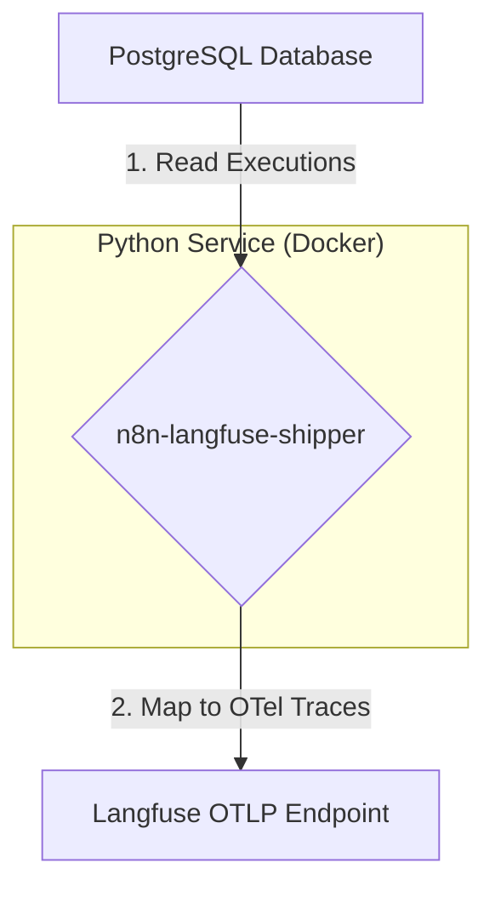

# AI Coding Agent Instructions for n8n-langfuse-shipper

## Purpose
This project is a Python-based microservice to perform a high-throughput backfill of historical n8n execution data from a PostgreSQL database to Langfuse. The service will map n8n's execution model to the Langfuse data model and transmit the data via the OpenTelemetry (OTLP) endpoint. The focus is on correctness, performance, and robustness for large-scale data migration.

## Big Picture Architecture
The service operates as a standalone ETL (Extract, Transform, Load) process, designed for containerized, cron-based execution.



1.  **Extract:** The service connects to the n8n PostgreSQL database and streams execution records (`n8n_execution_entity` joined with `n8n_execution_data`).
2.  **Transform:** Each execution record is transformed into a single Langfuse trace. The nodes within the execution are mapped to nested OpenTelemetry spans. This includes mapping specific AI node runs to Langfuse `Generation` objects via semantic attributes and handling multimodal (binary) data.
3.  **Load:** The transformed trace and its spans are exported to the Langfuse OTLP endpoint using the OpenTelemetry SDK.

## Core Data Models (Pydantic)
All internal data structures must be defined using Pydantic models for type safety and validation.

### 1. Raw N8N Data Models
These models represent the JSON data retrieved from the `n8n_execution_data` and `n8n_execution_entity` tables.

```python
# src/models/n8n.py
from __future__ import annotations

from datetime import datetime
from typing import Any, Dict, List, Optional
from pydantic import BaseModel, Field


class NodeRunSource(BaseModel):
    previousNode: Optional[str] = None
    previousNodeRun: Optional[int] = None


class NodeRun(BaseModel):
    startTime: int
    executionTime: int
    executionStatus: str
    data: Dict[str, Any] = Field(default_factory=dict)
    source: Optional[List[NodeRunSource]] = None
    inputOverride: Optional[Dict[str, Any]] = None
    error: Optional[Dict[str, Any]] = None


class ResultData(BaseModel):
    runData: Dict[str, List[NodeRun]] = Field(default_factory=dict)


class ExecutionDataDetails(BaseModel):
    resultData: ResultData


class ExecutionData(BaseModel):
    executionData: ExecutionDataDetails


class WorkflowNode(BaseModel):
    name: str
    type: str
    category: Optional[str] = None


class WorkflowData(BaseModel):
    id: str
    name: str
    nodes: List[WorkflowNode] = Field(default_factory=list)
    connections: Dict[str, Any] = Field(default_factory=dict)


class N8nExecutionRecord(BaseModel):
    id: int
    workflowId: str
    status: str
    startedAt: datetime
    stoppedAt: datetime
    workflowData: WorkflowData
    data: ExecutionData
```

### 2. Langfuse Target Models
These models represent the logical structure before creating OTel objects.

```python
# src/models/langfuse.py
from __future__ import annotations

from datetime import datetime
from typing import Any, Dict, List, Optional
from pydantic import BaseModel, Field


class LangfuseUsage(BaseModel):
    promptTokens: Optional[int] = None
    completionTokens: Optional[int] = None
    totalTokens: Optional[int] = None


class LangfuseGeneration(BaseModel):
    span_id: str
    model: Optional[str] = None
    usage: Optional[LangfuseUsage] = None
    input: Optional[Any] = None
    output: Optional[Any] = None


class LangfuseSpan(BaseModel):
    id: str
    trace_id: str
    parent_id: Optional[str] = None
    name: str
    start_time: datetime
    end_time: datetime
    observation_type: str = "span"
    input: Optional[Any] = None
    output: Optional[Any] = None
    metadata: Dict[str, Any] = Field(default_factory=dict)
    error: Optional[Dict[str, Any]] = None
    model: Optional[str] = None
    token_usage: Optional[LangfuseUsage] = None
    status: Optional[str] = None


class LangfuseTrace(BaseModel):
    id: str
    name: str
    timestamp: datetime
    metadata: Dict[str, Any] = Field(default_factory=dict)
    spans: List[LangfuseSpan] = Field(default_factory=list)
    generations: List[LangfuseGeneration] = Field(default_factory=list)
```

## Data Parsing & Resilience
The `data` column in `n8n_execution_data` can have multiple formats. The application must robustly parse them.
- **Standard Format:** A JSON object containing an `executionData` key.
- **Pointer-Compressed Format:** A top-level JSON array where objects reference other array elements by their index. Implement a resolver (`_decode_compact_pointer_execution`) to reconstruct the `runData` from this format.
- **Alternative Paths:** The `runData` object might be located at different nested paths. The parser (`_build_execution_data`) must probe multiple candidate paths to find it.
- **Empty/Invalid Data:** If `runData` cannot be found, the execution should still be processed, resulting in a trace with only a root span.

## Mapping Logic
The core transformation logic resides in the `mapper` module.

### Trace Mapping
- An `N8nExecutionRecord` maps to a single `LangfuseTrace`.
- `LangfuseTrace.id` must be deterministic: `f"n8n-exec-{record.id}"`.
- A root `LangfuseSpan` is created to represent the entire execution, with its start/end times matching the execution's `startedAt`/`stoppedAt`. All other node spans are children of this root span.

### Span Mapping
- Each `NodeRun` maps to a `LangfuseSpan`.
- `LangfuseSpan.id` must be deterministic: a UUIDv5 hash of `f"{trace_id}:{node_name}:{run_index}"`.
- **Parent-Child Linking:** Implement a three-tier fallback logic for parent resolution:
    1.  **Precise:** Use `source.previousNodeRun` to link to the exact parent run's deterministic ID.
    2.  **Execution Order Fallback:** If `previousNodeRun` is absent, link to the last seen span for the `source.previousNode`.
    3.  **Static Graph Fallback:** If runtime source is missing, use a reverse-edge graph built from `workflowData.connections` to infer a static parent.
- **I/O Propagation:** If a `NodeRun` lacks `inputOverride`, its logical input should be inferred from the `data` field of its resolved parent node.
- **Metadata Enrichment:** Spans must be enriched with metadata like `n8n.node.type`, `n8n.node.run_index`, `n8n.node.execution_status`, and flags indicating if I/O was truncated.

### Observation Type Mapping
- Use the `observation_mapper.py` module to classify each node.
- Create a lookup map of `node_name -> (type, category)` from `workflowData.nodes`.
- Use this map to determine the `LangfuseSpan.observation_type` for each node run.

### Generation Mapping
- The mapper identifies LLM node runs via heuristics (`_detect_generation`) and extracts token usage (`_extract_usage`).
- The `LangfuseSpan` is populated with `model` and `token_usage` data.
- The shipper will later use these fields to set the appropriate `gen_ai.*` and `model` attributes on the OTel span, allowing Langfuse to classify it as a `generation`.

### Multimodality Mapping
- This is a future requirement. The logic will be:
    1.  **Detect:** Identify binary data fields (e.g., base64 strings in I/O).
    2.  **Upload:** Use the Langfuse REST API (`POST /api/public/media`) to upload the binary content via a separate `httpx` client.
    3.  **Replace:** In the span's I/O field, replace the binary data with the Langfuse Media Token string (`@@@langfuseMedia:...`).
    4.  **Transmit:** Send the OTel span with the reference string.

## OpenTelemetry Shipper
The `shipper.py` module converts the internal `LangfuseTrace` model into OTel spans and exports them.
- **Initialization:** The OTLP exporter is configured once with the Langfuse endpoint and Basic Auth credentials derived from settings.
- **Span Creation:** For each `LangfuseSpan`, create an OTel span with the exact `start_time` and `end_time`.
- **Attribute Mapping:** The shipper is responsible for setting OTel attributes based on the `LangfuseSpan` model:
    - `langfuse.observation.type` <- `observation_type`
    - `model` & `langfuse.observation.model.name` <- `model`
    - `gen_ai.usage.*` <- `token_usage` fields
    - `langfuse.observation.metadata.*` <- `metadata` dictionary
    - `langfuse.observation.level` and `status_message` for errors.
- **Trace Attributes:** Set trace-level attributes (`langfuse.trace.name`, `langfuse.trace.metadata.*`) on the root span.

## Application Flow & Control
- **Main Loop:** The application is a CLI script (`__main__.py`) that loads a checkpoint, streams execution batches from PostgreSQL, maps each record to a `LangfuseTrace`, passes it to the shipper, and updates the checkpoint.
- **Checkpointing:** Use the `checkpoint.py` module to atomically store the last successfully processed `executionId` in a file, ensuring resumability.
- **CLI Interface:** Use `Typer`. The `backfill` command must support:
    - `--start-after-id`: Override the checkpoint.
    - `--limit`: Limit the number of executions per run.
    - `--dry-run`: Perform mapping but do not export data.
    - `--debug`: Enable verbose logging for data parsing.
    - `--debug-dump-dir`: Dump raw execution JSON to a directory for inspection.

## Key Environment Variables
- `PG_DSN`: Full PostgreSQL connection string (takes precedence).
- `DB_POSTGRESDB_HOST`, `DB_POSTGRESDB_PORT`, `DB_POSTGRESDB_DATABASE`, `DB_POSTGRESDB_USER`, `DB_POSTGRESDB_PASSWORD`: Component-based DB connection variables.
- `DB_POSTGRESDB_SCHEMA`: Database schema (default: `public`).
- `DB_TABLE_PREFIX`: n8n table prefix (default: `n8n_`).
- `LANGFUSE_HOST`: Base URL for Langfuse.
- `LANGFUSE_PUBLIC_KEY`, `LANGFUSE_SECRET_KEY`: Auth credentials.
- `LOG_LEVEL`, `FETCH_BATCH_SIZE`, `TRUNCATE_FIELD_LEN`.

## Development Plan (Next Iterations)
1.  **Nested Spans:** Implement logic to detect and map internal tool calls or sub-runs within a single n8n node run into their own nested spans.
2.  **Media Handling:** Implement the full multimodality mapping workflow (detect, upload, replace).
3.  **Error Handling:** Add robust retry mechanisms for media uploads and a dead-letter queue for executions that fail to map after multiple attempts.
4.  **Performance Tuning:** Investigate parallel processing of batches and asynchronous span exporting.
5.  **Advanced Filtering:** Add CLI flags to filter executions by status, time window, or workflow ID.

## Key Files & Project Structure
```
n8n-langfuse-shipper/
├── src/
│   ├── __main__.py
│   ├── config.py
│   ├── db.py
│   ├── mapper.py
│   ├── observation_mapper.py
│   ├── shipper.py
│   ├── checkpoint.py
│   └── models/
│       ├── __init__.py
│       ├── n8n.py
│       └── langfuse.py
├── Dockerfile
├── pyproject.toml
└── README.md
```

## Conventions & Best Practices
- **Idempotency:** Use deterministic UUIDs for spans and traces.
- **Error Handling:** Use `tenacity` for retrying database connections.
- **Logging:** Use structured logging for clear diagnostics.
- **Data Truncation:** Aggressively truncate large I/O fields and indicate this with a metadata flag.