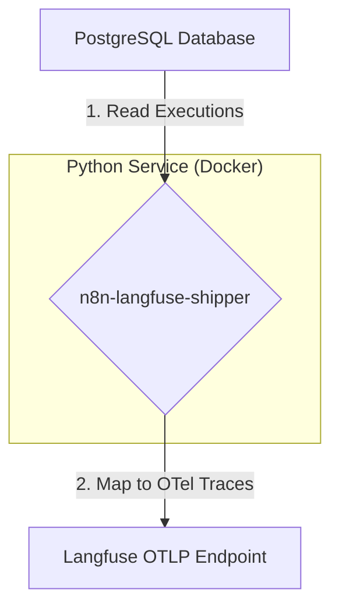

# AI Coding Agent Instructions for n8n-langfuse-shipper

## Purpose
This project is a Python-based microservice to perform a high-throughput backfill of historical n8n execution data from a PostgreSQL database to Langfuse. The service will map n8n's execution model to the Langfuse data model and transmit the data via the OpenTelemetry (OTLP) endpoint. The focus is on correctness, performance, and robustness for large-scale data migration.

## Big Picture Architecture
The service operates as a standalone ETL (Extract, Transform, Load) process, designed for containerized, cron-based execution.



1.  **Extract:** The service connects to the n8n PostgreSQL database and streams execution records (`n8n_execution_entity` joined with `n8n_execution_data`).
2.  **Transform:** Each execution record is transformed into a single Langfuse trace. The nodes within the execution are mapped to nested OpenTelemetry spans. This includes mapping specific AI node runs to Langfuse `Generation` objects via semantic attributes and handling multimodal (binary) data.
3.  **Load:** The transformed trace and its spans are exported to the Langfuse OTLP endpoint using the OpenTelemetry SDK.

## Key Invariants (Do Not Break)
1. One n8n execution row (entity+data) → exactly one Langfuse trace.
2. Deterministic identifiers:
    - Trace id: `n8n-exec-<executionId>` (string tag; final OTel trace id is auto-generated per exporter rules but this string is embedded and used for deterministic span id salt).
    - Root span id: UUIDv5(namespace=SPAN_NAMESPACE, name=`f"{trace_id}:root"`).
    - Node span id: UUIDv5(namespace=SPAN_NAMESPACE, name=`f"{trace_id}:{node_name}:{run_index}"`).
3. Execution id appears once only as root span metadata key: `n8n.execution.id` (not duplicated at trace metadata level).
4. Spans are emitted in chronological order (by NodeRun `startTime`) so parents (agents) exist before their children.
5. Mapper is pure (no network / DB writes) → safe for dry-run and replay (idempotent).
6. **No random UUIDs**; always deterministic UUIDv5 or derived values.
7. Truncation disabled by default (`TRUNCATE_FIELD_LEN=0`). Binary/base64 stripping ALWAYS applies.
8. If parsing of execution data fails, still emit a root span (never abort entire batch silently).
9. All internal structures use Pydantic (validation / type safety).
10. Database access must remain read-only (SELECTs only).

## Core Data Models (Pydantic)
All internal data structures must be defined using Pydantic models for type safety and validation.

### 1. Raw N8N Data Models
These models represent the JSON data retrieved from the `n8n_execution_data` and `n8n_execution_entity` tables.

```python
# src/models/n8n.py
from __future__ import annotations

from datetime import datetime
from typing import Any, Dict, List, Optional
from pydantic import BaseModel, Field


class NodeRunSource(BaseModel):
    previousNode: Optional[str] = None
    previousNodeRun: Optional[int] = None


class NodeRun(BaseModel):
    startTime: int
    executionTime: int
    executionStatus: str
    data: Dict[str, Any] = Field(default_factory=dict)
    source: Optional[List[NodeRunSource]] = None
    inputOverride: Optional[Dict[str, Any]] = None
    error: Optional[Dict[str, Any]] = None


class ResultData(BaseModel):
    runData: Dict[str, List[NodeRun]] = Field(default_factory=dict)


class ExecutionDataDetails(BaseModel):
    resultData: ResultData


class ExecutionData(BaseModel):
    executionData: ExecutionDataDetails


class WorkflowNode(BaseModel):
    name: str
    type: str
    category: Optional[str] = None


class WorkflowData(BaseModel):
    id: str
    name: str
    nodes: List[WorkflowNode] = Field(default_factory=list)
    connections: Dict[str, Any] = Field(default_factory=dict)


class N8nExecutionRecord(BaseModel):
    id: int
    workflowId: str
    status: str
    startedAt: datetime
    stoppedAt: datetime
    workflowData: WorkflowData
    data: ExecutionData
```

### 2. Langfuse Target Models
These models represent the logical structure before creating OTel objects.

```python
# src/models/langfuse.py
from __future__ import annotations

from datetime import datetime
from typing import Any, Dict, List, Optional
from pydantic import BaseModel, Field


class LangfuseUsage(BaseModel):
    promptTokens: Optional[int] = None
    completionTokens: Optional[int] = None
    totalTokens: Optional[int] = None


class LangfuseGeneration(BaseModel):
    span_id: str
    model: Optional[str] = None
    usage: Optional[LangfuseUsage] = None
    input: Optional[Any] = None
    output: Optional[Any] = None


class LangfuseSpan(BaseModel):
    id: str
    trace_id: str
    parent_id: Optional[str] = None
    name: str
    start_time: datetime
    end_time: datetime
    observation_type: str = "span"
    input: Optional[Any] = None
    output: Optional[Any] = None
    metadata: Dict[str, Any] = Field(default_factory=dict)
    error: Optional[Dict[str, Any]] = None
    model: Optional[str] = None
    token_usage: Optional[LangfuseUsage] = None
    status: Optional[str] = None


class LangfuseTrace(BaseModel):
    id: str
    name: str
    timestamp: datetime
    metadata: Dict[str, Any] = Field(default_factory=dict)
    spans: List[LangfuseSpan] = Field(default_factory=list)
    generations: List[LangfuseGeneration] = Field(default_factory=list)
```

## Data Parsing & Resilience
The `data` column in `n8n_execution_data` can have multiple formats. The application must robustly parse them.
- **Standard Format:** A JSON object containing an `executionData` key.
- **Pointer-Compressed Format:** A top-level JSON array where objects reference other array elements by their index. Implement a resolver (`_decode_compact_pointer_execution`) to reconstruct the `runData` from this format.
- **Alternative Paths:** The `runData` object might be located at different nested paths. The parser (`_build_execution_data`) must probe multiple candidate paths to find it.
- **Empty/Invalid Data:** If `runData` cannot be found, the execution should still be processed, resulting in a trace with only a root span.

### Pointer-Compressed Decoding
`_decode_compact_pointer_execution` reconstructs executions stored as a top-level list of heterogenous objects referencing each other via string indices. Cycle protection and memoization are used. On failure it returns `None` so the caller can fall back to path probing.

## Mapping Logic
The core transformation logic resides in the `mapper` module. It must use a hybrid approach, combining runtime data with the static workflow graph.

### The Agent/Tool Hierarchy
A key pattern in n8n, especially with LangChain nodes, is an "Agent" node that uses other nodes as "Tools", "LLMs", or "Memory". The `workflowData.connections` object reveals this.
- A connection with `type: "main"` represents a sequential step.
- A connection with `type: "ai_tool"`, `type: "ai_languageModel"`, or `type: "ai_memory"` from a component node (e.g., `Calculator`) *to* an agent node (e.g., `HAL9000`) signifies a **hierarchical relationship**.
- In this case, the agent's span is the **parent** of the component's span.

### Trace Mapping
- An `N8nExecutionRecord` maps to a single `LangfuseTrace`.
- `LangfuseTrace.id` must be deterministic: `f"n8n-exec-{record.id}"`.
- A root `LangfuseSpan` is created to represent the entire execution. All top-level node spans are children of this root span.

### Span Mapping
- Each `NodeRun` maps to a `LangfuseSpan`.
- `LangfuseSpan.id` must be deterministic: a UUIDv5 hash of `f"{trace_id}:{node_name}:{run_index}"`.
- **Parent-Child Linking:** Implement a multi-tier logic for parent resolution:
    1.  **Hierarchical (Agent/Tool):** First, check `workflowData.connections`. If a node run corresponds to a node that is connected to an Agent via a non-`main` connection type, its parent is the most recent span of that Agent.
    2.  **Sequential (Runtime):** If not part of a hierarchy, use `run.source[0].previousNode` to find the immediate predecessor. Link to the exact run index (`previousNodeRun`) if available, otherwise link to the last seen span for that predecessor node.
    3.  **Sequential (Static Fallback):** If runtime `source` is missing, use a reverse-edge map built from `workflowData.connections` to infer the most likely parent from the static graph.
    4.  **Root Fallback:** If no parent can be determined, link to the root execution span.
- **I/O Propagation:** If a `NodeRun` lacks `inputOverride`, its logical input is inferred from the cached raw output of the resolved parent node: `{ "inferredFrom": <parent>, "data": <parent_raw_output> }`.

Additional implemented behavior:
* Reverse graph fallback marks metadata `n8n.graph.inferred_parent=true`.
* Agent hierarchy adds `n8n.agent.parent` and `n8n.agent.link_type` (`ai_tool|ai_languageModel|ai_memory`).
* Input propagation caching only size-guards when truncation active (`truncate_limit > 0`). When disabled, propagation always occurs.

### Observation Type Mapping
- Use the `observation_mapper.py` module to classify each node based on its type and category. This determines the `LangfuseSpan.observation_type`.

### Generation Mapping
- The mapper identifies LLM node runs via heuristics (`_detect_generation`) and extracts token usage (`_extract_usage`).
- The `LangfuseSpan` is populated with `model` and `token_usage` data. The shipper will use these to set OTel attributes (`gen_ai.usage.*`, `model`), allowing Langfuse to classify the span as a `generation`.

Heuristics (keep conservative):
1. Presence of `tokenUsage` inside `run.data`.
2. Fallback: node type contains provider substrings (OpenAi, Anthropic, Gemini, Mistral, Groq, etc.).
`_extract_usage` maps token fields to `LangfuseUsage` and later OTLP attributes.

### Multimodality Mapping
- This is a future requirement. The logic will be:
    1.  **Detect:** Identify binary data fields (e.g., base64 strings in I/O).
    2.  **Upload:** Use the Langfuse REST API (`POST /api/public/media`) to upload the binary content.
    3.  **Replace:** In the span's I/O field, replace the binary data with the Langfuse Media Token string (`@@@langfuseMedia:...`).

### Current Binary / Large Payload Handling (Implemented Now)
Detection heuristics:
* Standard n8n `binary` object (nested item with `mimeType` and a large `data` field).
* Any long (≥200 chars) base64-looking string (regex) or base64 starting with `/9j/` (JPEG magic) anywhere in the structure.

Replacement strategy:
* In `binary` objects: replace `data` string with `"binary omitted"` + `_omitted_len` while preserving mime/file metadata.
* Standalone base64 strings replaced with: `{ "_binary": true, "note": "binary omitted", "_omitted_len": <length> }`.

Always occurs regardless of truncation settings (prevents enormous payloads). Planned future hook: optional media upload converting placeholders to Langfuse media tokens.

## OpenTelemetry Shipper
The `shipper.py` module converts the internal `LangfuseTrace` model into OTel spans and exports them.
- **Initialization:** The OTLP exporter is configured once with the Langfuse endpoint and Basic Auth credentials.
- **Span Creation:** For each `LangfuseSpan`, create an OTel span with the exact `start_time` and `end_time`.
- **Attribute Mapping:** The shipper sets OTel attributes based on the `LangfuseSpan` model:
    - `langfuse.observation.type` <- `observation_type`
    - `model` & `langfuse.observation.model.name` <- `model`
    - `gen_ai.usage.*` <- `token_usage` fields
    - `langfuse.observation.metadata.*` <- `metadata` dictionary
    - `langfuse.observation.level` and `status_message` for errors.
- **Trace Attributes:** Set trace-level attributes (`langfuse.trace.name`, `langfuse.trace.metadata.*`) on the root span.
Additional notes:
* Root span metadata holds `n8n.execution.id`; not duplicated on trace metadata.
* Export order mirrors creation order; parents precede children.
* Dry-run mode constructs spans but does not send them (useful for testing determinism).

## Application Flow & Control
- **Main Loop:** A CLI script (`__main__.py`) that loads a checkpoint, streams execution batches from PostgreSQL, maps each record to a `LangfuseTrace`, passes it to the shipper, and updates the checkpoint.
- **Checkpointing:** Use the `checkpoint.py` module to atomically store the last successfully processed `executionId` in a file.
- **CLI Interface:** Use `Typer`. The `backfill` command supports:
    - `--start-after-id`, `--limit`, `--dry-run`, `--debug`, `--debug-dump-dir`
    - `--truncate-len` (0 disables truncation)
    - `--require-execution-metadata` (only process if a row exists in `<prefix>execution_metadata` with matching executionId)

## Key Environment Variables
- `PG_DSN`: Full PostgreSQL connection string (takes precedence).
- `DB_POSTGRESDB_HOST`, `DB_POSTGRESDB_PORT`, `DB_POSTGRESDB_DATABASE`, `DB_POSTGRESDB_USER`, `DB_POSTGRESDB_PASSWORD`: Component-based DB connection variables.
- `DB_POSTGRESDB_SCHEMA`: Database schema (default: `public`).
- `DB_TABLE_PREFIX`: Optional table prefix (default if UNSET: `n8n_`; if set to empty string `""` no prefix is applied; any other explicit value is used verbatim). All table names are constructed dynamically at runtime—never hard-code `n8n_` in code paths.
- `LANGFUSE_HOST`, `LANGFUSE_PUBLIC_KEY`, `LANGFUSE_SECRET_KEY`.
- `LOG_LEVEL`, `FETCH_BATCH_SIZE`, `TRUNCATE_FIELD_LEN` (0 disables truncation; >0 enables).
- `REQUIRE_EXECUTION_METADATA` (bool): only include executions having at least one row in `<prefix>execution_metadata` with `executionId = e.id`.

### Environment Precedence Rules
1. `PG_DSN` (if non-empty) overrides component variables.
2. `DB_TABLE_PREFIX` unset → default `n8n_`; set to empty string → no prefix.
3. `TRUNCATE_FIELD_LEN=0` means disabled (still strip binary); positive value triggers truncation & size guard for propagation caching.
4. CLI flags override env values for that invocation.

## Development Plan (Next Iterations)
1.  **Agent Hierarchy Mapping:** Implement the hierarchical parent-child linking logic using the `connections` object. This is the highest priority.
2.  **Media Handling:** Implement the full multimodality mapping workflow (detect, upload, replace).
3.  **Error Handling:** Add robust retry mechanisms for media uploads and a dead-letter queue for executions that fail to map.
4.  **Performance Tuning:** Investigate parallel processing of batches and asynchronous span exporting.
5.  **Advanced Filtering:** Add CLI flags to filter executions by status, time window, or workflow ID.

## Key Files & Project Structure
```
n8n-langfuse-shipper/
├── src/
│   ├── __main__.py
│   ├── config.py
│   ├── db.py
│   ├── mapper.py
│   ├── observation_mapper.py
│   ├── shipper.py
│   ├── checkpoint.py
│   └── models/
│       ├── __init__.py
│       ├── n8n.py
│       └── langfuse.py
├── Dockerfile
├── pyproject.toml
└── README.md
```

## Conventions & Best Practices
- **Idempotency:** Use deterministic UUIDs for spans and traces.
- **Error Handling:** Use `tenacity` for retrying database connections.
- **Logging:** Use structured logging for clear diagnostics.
- **Data Truncation:** Disabled by default; when enabled post-binary stripping, sets `n8n.truncated.input|output` metadata.
- **Binary Stripping:** Always on; do not remove without tests + docs.
- **Parent Resolution Order:** Agent hierarchy → runtime sequential exact run → runtime sequential last span → static graph reverse-edge → root.
- **Input Propagation:** Uses cached parent output unless explicit `inputOverride` present.
- **Generation Detection:** Keep conservative; update tests when heuristics change.
- **Metadata Keys:** Additions require justification + test coverage.

## Reserved Metadata Keys
Root span:
- `n8n.execution.id`
All spans (optional context):
- `n8n.node.type`, `n8n.node.category`, `n8n.node.run_index`, `n8n.node.execution_time_ms`, `n8n.node.execution_status`
- `n8n.node.previous_node`, `n8n.node.previous_node_run`
- `n8n.graph.inferred_parent`
- `n8n.agent.parent`, `n8n.agent.link_type`
- `n8n.truncated.input`, `n8n.truncated.output`

## Testing Guidance
Add / update tests when:
1. Changing parent resolution logic (each precedence path covered).
2. Adjusting binary stripping heuristics (base64, JPEG, nested arrays, `binary` object patterns).
3. Modifying generation detection or usage extraction.
4. Updating pointer-compressed decoding.
5. Changing truncation / propagation coupling.
Each new metadata key must appear in at least one assertion.

## Contribution Guardrails (AI & Humans)
- No new dependencies without `pyproject.toml` update + rationale.
- Preserve deterministic UUIDv5 namespace string and format of name seeds.
- Mapper stays pure (no network / DB writes). Future media upload lives in separate module.
- Backwards compatibility: never rename/remove public model fields without migration notes.
- Update README + this file for new env vars / CLI flags.
- NOTICE & LICENSE untouched aside from annual year updates.

## Quick Pipeline Summary
1. Fetch execution rows (optional metadata existence filter).
2. Parse (standard / alternative paths / pointer-compressed).
3. Flatten runs chronologically.
4. Resolve parents per precedence.
5. Infer inputs (unless overridden).
6. Strip binary → (optional) truncate.
7. Determine observation type & generation usage.
8. Build spans & generation records.
9. Export (or dry-run) via OTLP.
10. Update checkpoint (non dry-run).

## Performance Notes
- Streaming limits memory usage; only a batch of rows in memory.
- Caching only last outputs reduces accumulation risk.
- Potential optimization: batch OTLP export or async spans while preserving parent ordering.

## Planned Media Upload Hook (Future)
Hook after binary stripping, before OTLP export:
1. Identify placeholder binary markers.
2. Upload original content (if still accessible) → receive media token.
3. Replace placeholder with `@@@langfuseMedia:<token>`.
4. On failure: log & retain placeholder (never break entire execution).

## Failure & Resilience Philosophy
- Non-critical parsing errors downgrade to root-only traces.
- Database transient errors retried (exponential backoff).
- Mapping should never raise fatal exceptions that stop the stream unless configuration is invalid (e.g., DSN missing).
- (Future) Dead-letter queue for repeated mapper failures.

---
This document is the authoritative contract. Any significant code change altering behavior here must include an update to this file in the same PR.