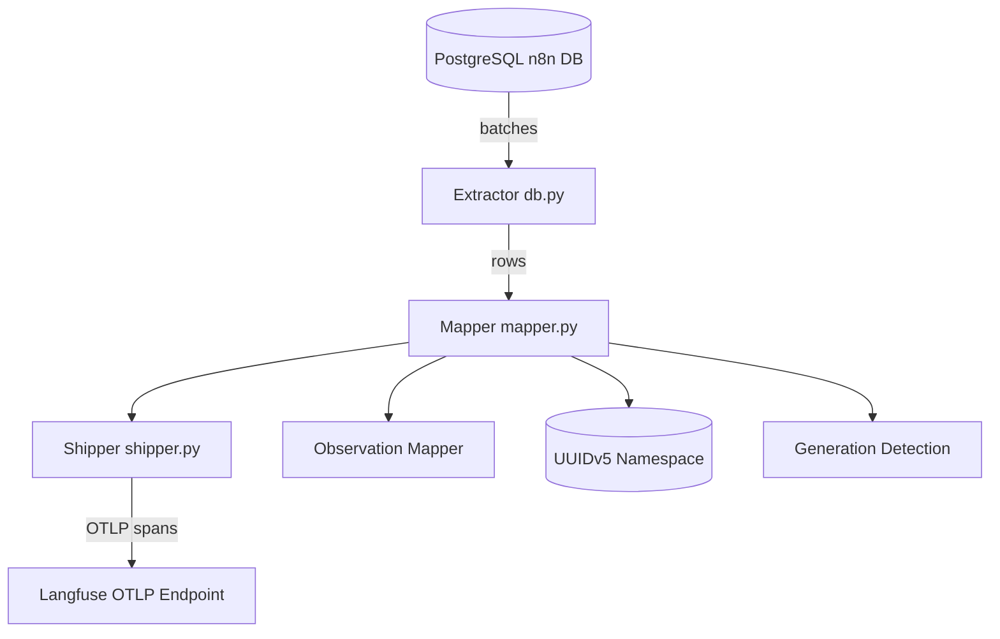

# n8n-langfuse-shipper

<!-- Badges -->


<!-- (Optionally replace placeholders with real workflow badges once CI is added) -->

High‑throughput backfill service that reads historical n8n execution data from PostgreSQL and ships it to Langfuse via the OpenTelemetry (OTLP/HTTP) endpoint.

Current status: Iteration 2 (mapping + real Postgres streaming, dry‑run exporter). OTLP export path is wired and can be enabled when credentials are provided (non‑dry run).

---

## Features Implemented (Iteration 2)

- Pydantic v2 models for raw n8n execution JSON (`src/models/n8n.py`).
- Internal Langfuse models (`src/models/langfuse.py`).
- Observation type inference ported from JS mapper (`src/observation_mapper.py`).
- Deterministic span & trace ID mapping (`uuid5` namespace) in `src/mapper.py`.
- Real PostgreSQL streaming with batching, retry & schema/prefix awareness (`src/db.py`).
- CLI with `backfill` subcommand, supports `--start-after-id`, `--limit`, `--dry-run`.
- Minimal OTLP shipper (`src/shipper.py`) that sets Langfuse + GenAI semantic attributes.
- Auto-construction of `PG_DSN` from n8n style `.env` variables if not explicitly set.
- Basic integration tests for database streaming (read‑only) under `tests/`.

---

## Architecture



Key points:
- Streaming reader keeps memory footprint low (batch size controlled by `FETCH_BATCH_SIZE`).
- Pure transform layer builds internal Pydantic models before any OTLP emission (testable & dry-run friendly).
- Deterministic IDs ensure idempotent re-processing (safe restarts & checkpoint replay).
- Generation detection augments spans with GenAI semantic attributes so Langfuse auto-classifies them.

---

## Installation

Create / activate a Python 3.12 environment, then:

```bash
pip install -e .[dev]
```

Run tests (optional):

```bash
pytest -q
```

---

## Configuration

The service reads settings via environment variables (`pydantic-settings`). Either provide a full DSN or rely on n8n component variables:

| Purpose | Variable(s) |
|---------|-------------|
| Full DSN override | `PG_DSN` |
| Component DB vars (used if `PG_DSN` blank) | `DB_POSTGRESDB_HOST`, `DB_POSTGRESDB_PORT`, `DB_POSTGRESDB_DATABASE`, `DB_POSTGRESDB_USER`, `DB_POSTGRESDB_PASSWORD` |
| Schema / table prefix | `DB_POSTGRESDB_SCHEMA` (default `public`), `DB_TABLE_PREFIX` (default `n8n_`) |
| Langfuse endpoint | `LANGFUSE_HOST` (e.g. `https://cloud.langfuse.com`) |
| Auth keys | `LANGFUSE_PUBLIC_KEY`, `LANGFUSE_SECRET_KEY` |
| Optional OTLP override | `OTEL_EXPORTER_OTLP_ENDPOINT` |
| Batch size | `FETCH_BATCH_SIZE` (default 100) |
| Truncation length | `TRUNCATE_FIELD_LEN` (default 4000 chars) |
| Checkpoint file | `CHECKPOINT_FILE` (future use) |

Example (fish shell):

```fish
set -x DB_POSTGRESDB_HOST localhost
set -x DB_POSTGRESDB_DATABASE n8n
set -x DB_POSTGRESDB_USER n8n
set -x DB_POSTGRESDB_PASSWORD n8n
set -x DB_POSTGRESDB_SCHEMA public
set -x DB_TABLE_PREFIX n8n_
set -x LANGFUSE_HOST https://cloud.langfuse.com
set -x LANGFUSE_PUBLIC_KEY lf_pk_... 
set -x LANGFUSE_SECRET_KEY lf_sk_...
```

If both component vars and `PG_DSN` are set, `PG_DSN` takes precedence.

---

## CLI Usage

Show help:

```bash
python -m src --help
```

Run a dry‑run backfill (fetch + map only, no network export):

```bash
python -m src backfill --limit 50 --dry-run
```

Export to Langfuse (remove `--dry-run`):

```bash
python -m src backfill --limit 50 --no-dry-run
```

Resume after a specific execution id:

```bash
python -m src backfill --start-after-id 12345 --limit 500 --dry-run
```

---

## Mapping Details

| n8n Concept | Langfuse Structure |
|-------------|-------------------|
| Execution row | One trace (root span represents whole execution) |
| Node run | Child span (deterministic ID) |
| LLM / embedding node with token usage | Span + generation observation classification |
| Node type/category | Observation type (`agent`, `tool`, `chain`, `retriever`, etc.) via mapper |
| Token usage (`tokenUsage` in node run) | GenAI semantic attributes (`gen_ai.usage.*`) + stored in model |

Parenting logic uses `source.previousNode` when available; otherwise root span.

---

## Examples

### 1. Quick Dry‑Run (no network)
Fetch first 25 executions, map to traces/spans, just log summary:

```fish
python -m src backfill --limit 25 --dry-run
```

### 2. Real Export
Assuming you have set `LANGFUSE_PUBLIC_KEY` / `LANGFUSE_SECRET_KEY` (and optionally `LANGFUSE_HOST`):

```fish
python -m src backfill --limit 100 --no-dry-run
```

### 3. Resume After a Known Execution ID

```fish
python -m src backfill --start-after-id 420000 --limit 500 --dry-run
```

### 4. Narrow Window (combine with future filters)
Planned future flags may allow filtering by status or date; for now you can externally pipe IDs.

### 5. Programmatic Use (Embedding as a Library)
If you want to call the mapper directly (e.g. inside another orchestration script):

```python
from src.mapper import map_execution_to_langfuse
from src.shipper import LangfuseOTLPShipper

# record = <load one execution row & JSON just like db.stream yields>
trace = map_execution_to_langfuse(record)
shipper = LangfuseOTLPShipper(dry_run=True)  # set False to export
shipper.export_trace(trace)
```

### 6. Environment Convenience (fish)
Persist frequently used variables in a local script:

```fish
function env.n8n-lf
	set -x DB_POSTGRESDB_HOST localhost
	set -x DB_POSTGRESDB_DATABASE n8n
	set -x DB_POSTGRESDB_USER n8n
	set -x DB_POSTGRESDB_PASSWORD n8n
	set -x LANGFUSE_HOST https://cloud.langfuse.com
	set -x LANGFUSE_PUBLIC_KEY lf_pk_xxx
	set -x LANGFUSE_SECRET_KEY lf_sk_xxx
end

env.n8n-lf; python -m src backfill --limit 50 --dry-run
```

### 7. Troubleshooting Tips
- If you see zero rows: verify `DB_TABLE_PREFIX` and `DB_POSTGRESDB_SCHEMA` match your n8n deployment.
- Large payload warnings: reduce `FETCH_BATCH_SIZE` or lower `TRUNCATE_FIELD_LEN`.
- Need verbose output: set `LOG_LEVEL=DEBUG` before running the CLI.

---

## Development Scripts (fish)

Install dev deps:

```fish
pip install -e .[dev]
```

Run lint (ruff) & type check (mypy):

```fish
ruff check .
mypy src
```

Run focused test:

```fish
pytest tests/test_db_stream.py::test_stream_reads_rows_without_modification -q
```

---

## Security & Safety

- Read-only queries: only `SELECT` statements used; no mutations or DDL.
- Deterministic IDs allow idempotent re-runs without duplicating spans.
- Truncation prevents oversized OTLP payloads.

---

## Roadmap (Next Iterations)

1. Checkpointing & resumability (persist last processed id).
2. Rich input/output extraction + optional masking.
3. Media (base64 detection & upload) handling.
4. Error retries with dead-letter logging.
5. Performance tuning (server-side cursors, parallelization).
6. Additional filtering (status, time window, workflow id).
7. Unit tests for mapper & observation type classification.

---

## Contributing

1. Fork & branch.
2. Add/adjust tests.
3. Run formatting/lint: `ruff check --fix .`.
4. Ensure tests pass.
5. Open PR with context (data volume considerations welcome).

---

## License

MIT


